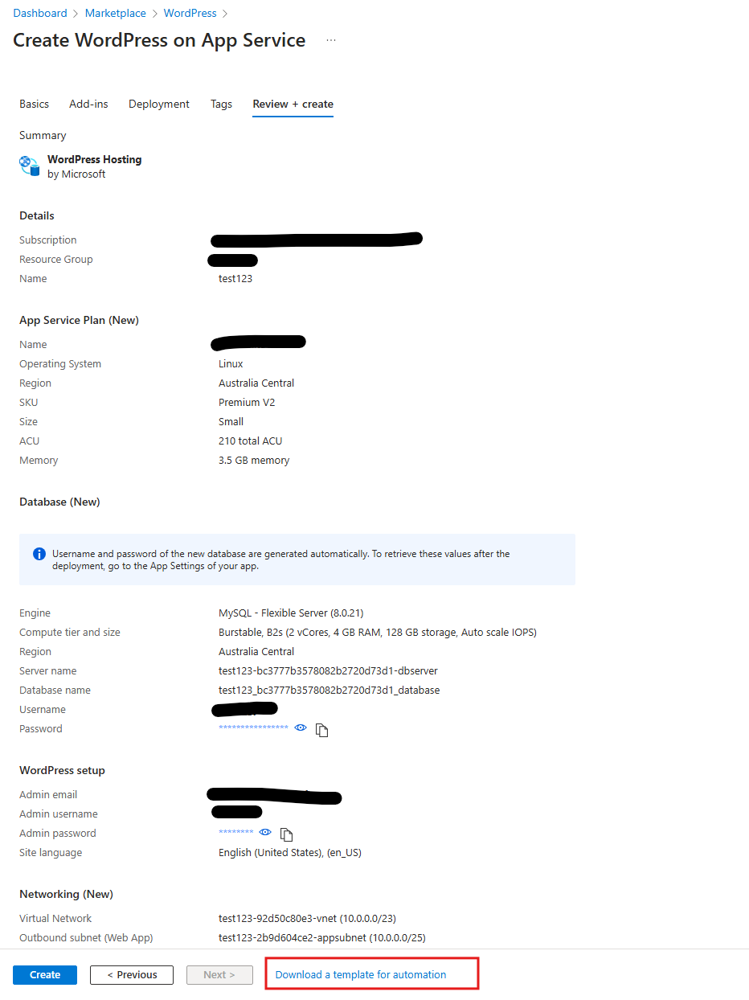
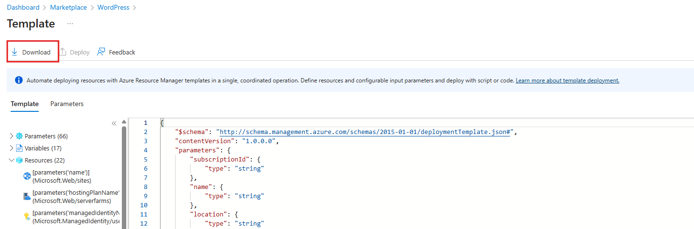

# 📝 ARM Template for WordPress on Linux App Service

This ARM template deploys the necessary resources to run a WordPress site on a Linux App Service. 🚀

🔧 **Deployed Resources:**
- App Service Hosting Plan: Provisioned with a WordPress container image based on the alpine latest build.
- App Service: Configured to use a WordPress container image based on the alpine latest build.
- MySQL Server: Running on the Flexible server SKU with a database deployed and configured for use with WordPress.
- Virtual Network: With a `10.0.0.0/16` CIDR block.
- Private DNS Zone: For the MySQL database.
- CDN Profile (Azure Front Door): With a CDN profile endpoint and compression enabled.
- Azure Blob Storage
- User Assigned Managed Identity

## 📥 How to Download Latest ARM Template with Pre-populated Parameters via UI Experience?
1. Click 

2. Fill in all the required details, such as Subscription ID, Resource Group Name, Hosting plan, Location, etc., in the provided tabs. Complete all the required tabs: 'Basics', 'Add-ins', 'Deployment', 'Tags', and finally 'Review + create'.
3. Ensure there are no validation failures once go to 'Review + create' tab. The ARM template will be auto-generated based on your UI inputs. Refer screenshot below:

    

4. Download the `template.zip` file, which contains `parameters.json` and `template.json` as shown in screenshot below:

    

5. Replace the existing `azuredeploy.parameters.json` and `azuredeploy.json` files in this folder with the downloaded files.

### 🔍 Overview of template files
The main ARM template (`azuredeploy.json`) is highly configurable and well-documented. You can deploy it without making any changes, but it will prompt you for parameters. You can pre-populate these parameters using the included parameters file (`azuredeploy.parameters.json`).

## 🚀 How to Deploy
1. Modify the parameters file (`azuredeploy.parameters.json`) with the input values for your environment. It's recommended to have a parameters file per environment/deployment.
2. Replace the `null` values in the file with the appropriate settings for your configuration as few sensitive parameters as secure strings and those are set to `null`.
3. Modify the deployment scripts (`deploy.azcli` and `deploy.ps1`) and update the input parameters, such as the resource group name and location, to match your deployment needs.
4. Run the deployment scripts:
    - For Bash script: `./deploy.azcli`
    - For PowerShell script: `./deploy.ps1`

## ✨ Common Scenarios Requiring ARM Template Customization

When using the Azure Portal UI, users can create a customized ARM template by selecting their preferred location, hosting plan, and out-of-the-box content delivery integrations. However, there may be cases where further customization is required to address specific needs. 

For these scenarios, it is recommended to start by interacting with the Azure Portal UI to generate a basic template. Once created, you can download the `template.zip` as described earlier, and then modify the `parameters.json` or `template.json` files based on your requirements. You can also explore all ARM templates for various Azure services [here](https://learn.microsoft.com/en-us/azure/templates/) for additional customization.

Here are a few common scenarios where further customization might be needed:

- Create WordPress on [App Service Environment](https://learn.microsoft.com/en-us/azure/app-service/environment/overview) or in a more restricted location if you have approved quota limits.
- Change the SKU or add additional configurations to the underlying Azure resources to customize your WordPress site.
- Bring your own existing Azure Flexible MySQL Server or adjust the location apart from the pre-configured options.
- Enable zone or region redundancy for the underlying Azure resources to ensure high availability and prevent data loss for your WordPress site.
