# WordPress Migration Plugin Quickstart Guide

In this quickstart guide, you will learn how to install and use the Azure App Service Migration plugin. This plugin allows you to migrate a WordPress site from any hosting platform to a WordPress site on the Azure Linux App Service. The migration process involves exporting the WordPress content from the source site as a zip file and then importing it into the destination WordPress site on the Azure Linux App Service.

```
**Note**: This plugin will work only for the site with content(Web + DB) size 4 GB. If your site size is more than 4 GB then you have to follow the steps described in this [migration guide](https://github.com/Azure/wordpress-linux-appservice/tree/main/WordPress%20Migration%20Tool) 
```

## Prerequisites

Before you begin, make sure you have the following prerequisites in place:

- **PHP**: Version 7.0 or higher
  - Ensure that the source site has PHP version 7.0 or higher.
  - Note that the destination WordPress site on the Azure Linux App Service runs on PHP version 8.0 or higher.

## Installation

Follow these steps to install the Azure App Service Migration plugin:

1. Download the plugin zip file from [here](https://github.com/Azure/wordpress-linux-appservice/blob/main/WordPress%20Migration%20Plugin/azure_app_service_migration.zip).

2. Open the WordPress dashboard of your site.

3. In the dashboard menu, navigate to **Plugins > Add New** section.

   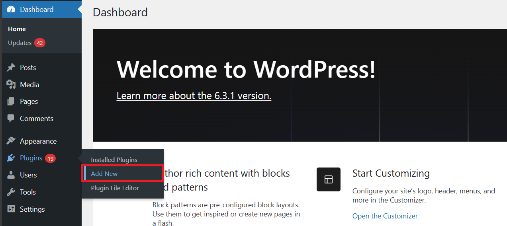

4. Click on **Upload Plugin** and select the plugin zip file.

   

5. Click on **Install**.

   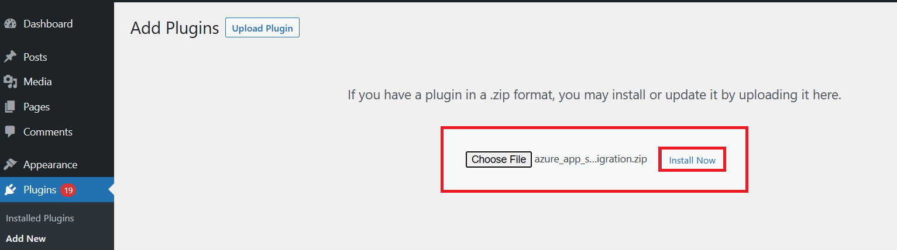

6. After installation, click on **Activate**.

   

## Export

To export your WordPress content from the source site, follow these steps:

1. Open the **Export** section of the Azure App Service Migration plugin.

  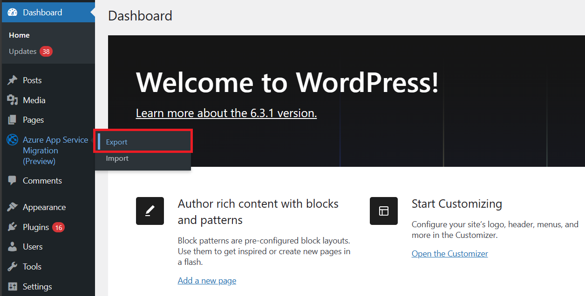

2. Configure the desired export options.

3. Click on **Generate Export File**.

   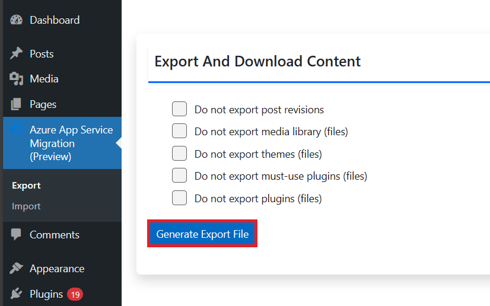

4. A popup will appear when the export is complete. Download the export zip file.

   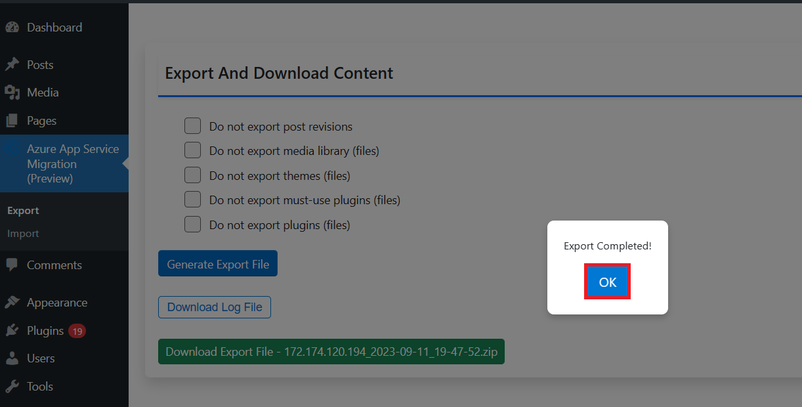

   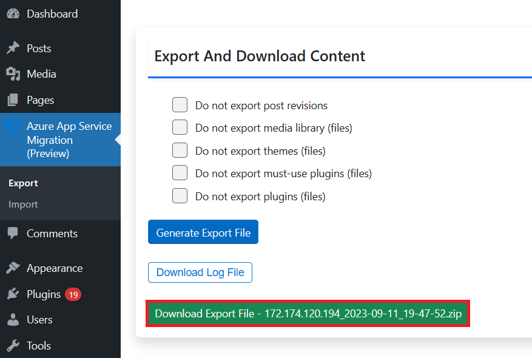

## Import

To import the content into your destination WordPress site on the Azure Linux App Service, follow these steps:

1. Open the **Import** section of the Azure App Service Migration plugin.
    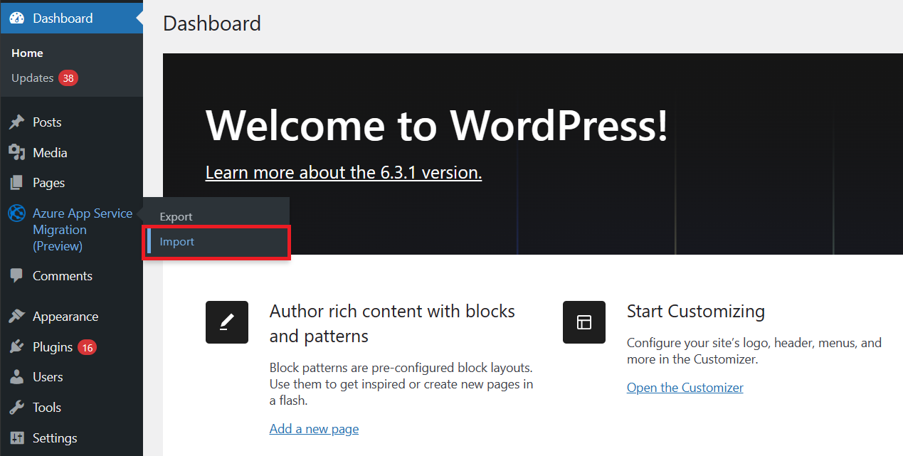

2. Select the zip file that you exported from the source site previously.

   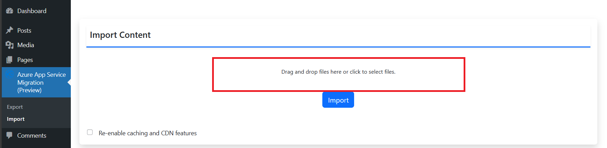

3. Enable the checkbox if you want to retain caching/CDN features that we provide by default. Note that enabling this will install and overwrite W3 total cache plugin configuration of the imported site.

   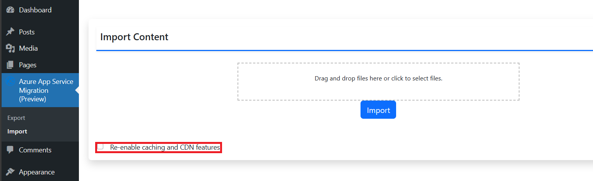

4. Click on **Import**.

   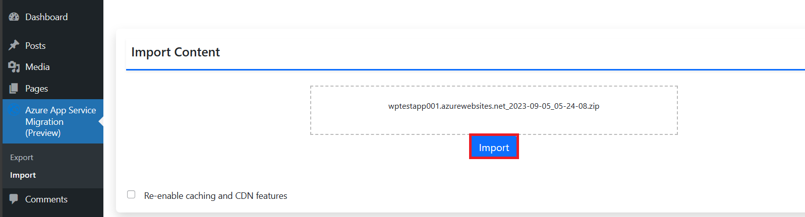

5. You can monitor the progress of the import process.

   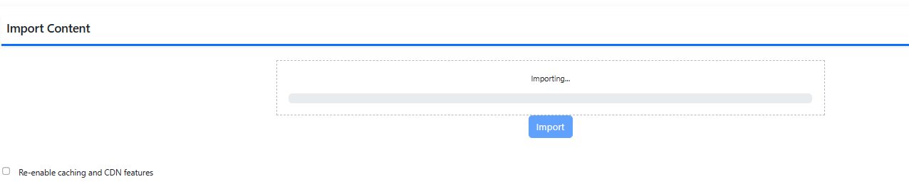

6. Once the import is complete, refresh the page and log in with the credentials of the source site.

## Support

If you encounter any issues or have questions, please feel free to reach out to us at `wordpressonappservice@microsoft.com`. In case of errors with the plugin, make sure to attach the log file to your email for efficient assistance.
