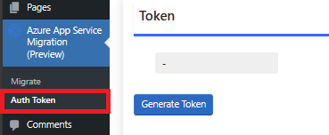
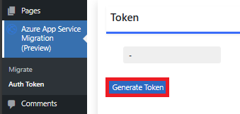
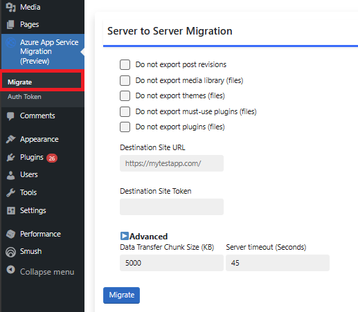
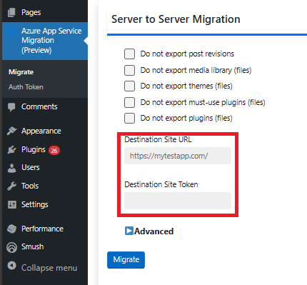
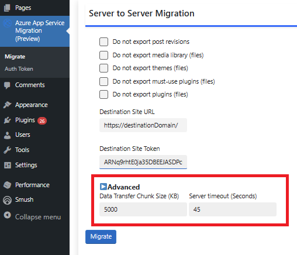
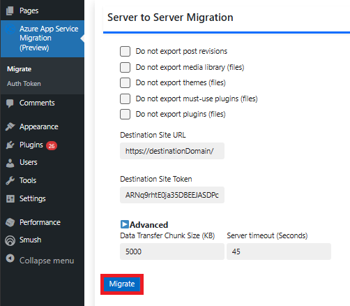

# Azure App Service Migration Quickstart

In this quickstart, you will learn how to use the Azure App Service Migration plugin in WordPress to migrate any WordPress site to a WordPress on Linux App Service site. Follow the steps in 'How to Migrate' section to migrate your site to a WordPress linux App Service site.

## Prerequisites

- A Source WordPress site that will be used to migrate to WordPress on Linux App Service
- WordPress on Linux App Service Site (referred to here as the destination site)

## Follow these steps to test the Migration plugin:

1. Install Migration plugin on both source and destination sites.

2. Navigate to the destination site and open the 'Authentication Token' page as shown below.
   
   

3. Generate a new Authentication Token and copy it.

   

   

4. Copy the destination site URL. Ensure it is of the form 'https://<Destination Site Domain>/'

   

5. Now, navigate to the 'Migrate' page on the source site and input the destination Site URL and Authentication token.
   
   

   

6. You can edit Advanced options detailed below in case you see data transfer failures.

   

7. Click on Migrate and wait for the Migration completion status popup to show up.

   

## Advanced Section

To understand the parameters and how they can be leveraged to ensure the reliability of migration, you need to understand how the migration plugin transfers files from the source to the destination site. The migration plugin packs the source site's data and transfers it in chunks of a default size of 5MB (configurable as Data Transfer Chunk Size parameter). The plugin waits for each chunk transfer for 'Server Timeout' minutes before sending the next chunk.

The Advanced Section allows you to configure two Migration parameters: 'Data Transfer Chunk Size' and 'Server Timeout'

### When do I update these parameters?

Usually, the default parameter values should suffice for the migration to work, but you may have to update them in case of chunk transfer failures. Chunk transfer failures may occur due to a slow internet connection or if the server timeout value is lower than 45s. Follow these steps to prevent failures.

- **Adjust Server Timeout:** The default value here is 45s. You can set this to `min(Server_Timeout(Source Site), Server_Timeout(Destination_Site)) - 10s`
  *Server_Timeout(site)* is the timeout value of the site in seconds.

- **Adjust Data Transfer Chunk size:** Once the server timeout value is adjusted, you can try different chunk sizes and keep lowering it until the failures stop.

## Post Migration Actions

### Recommended WordPress Settings

The following WordPress settings are recommended. However, when the users migrate their custom sites, it is up to them to decide whether to use these settings or not.

- Open the WordPress Admin dashboard.
- Set the permalink structure to 'day and name', as it performs better compared to the plain permalinks that use the format ?p=123.
- Under the comment settings, enable the option to break comments into pages.
- Show excerpts instead of the full post in the feed.

### Search And Replace (paths and domains)

One common issue that users face during migration is that some of the contents of their old site use absolute urls/paths instead of relative ones. To resolve this issue, you can use plugins like Search and Replace to update the database records.

### Configuring Custom Domain

If you plan to set up your site with a new Custom Domain, please follow the steps described [here](https://docs.microsoft.com/en-us/azure/app-service/manage-custom-dns-migrate-domain).

### Migrating Custom Domain

When you migrate a live site and its DNS domain name to App Service, that DNS name is already serving live traffic. You can avoid downtime in DNS resolution during the migration by binding the active DNS name to your App Service app preemptively as per the steps described [here](https://docs.microsoft.com/en-us/azure/app-service/web-sites-custom-domain-name-migrate).

### Updating SSL Certificates

If your site is configured with SSL certs, then we need to redo the setup following the instructions [here](https://docs.microsoft.com/en-us/azure/app-service/configure-ssl-certificate).
