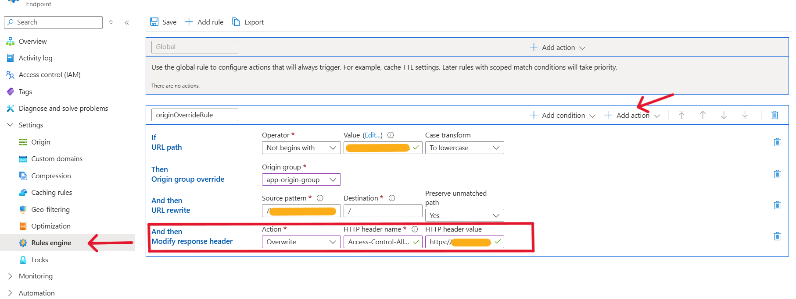
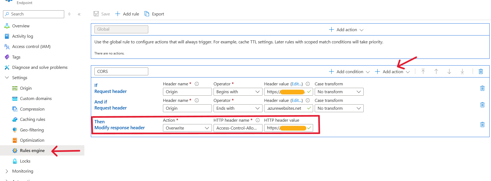
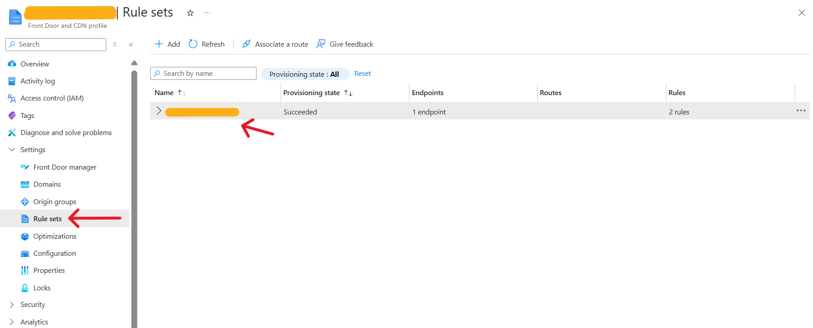
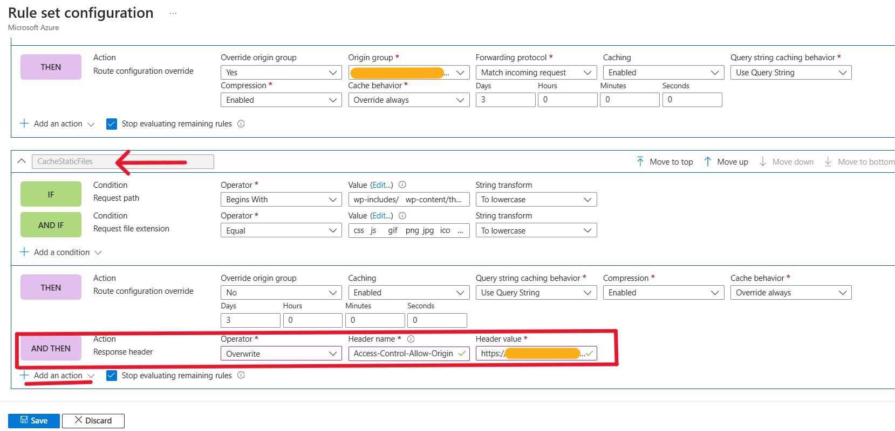
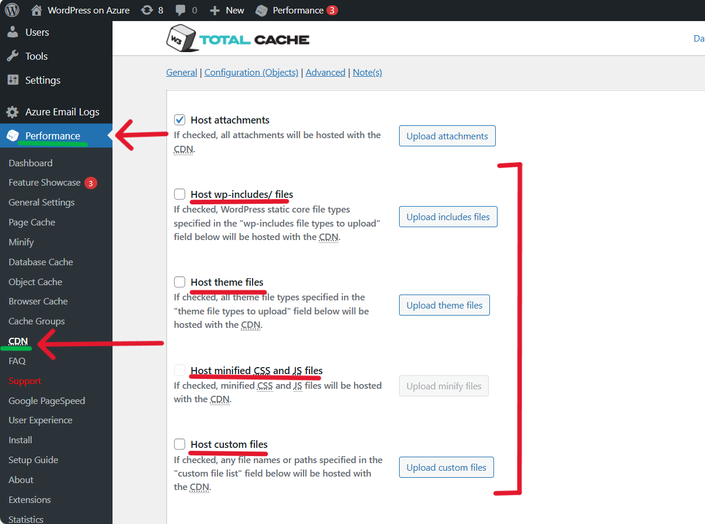

# CORS Issue With Azure CDN / FrontDoor or Azure Blob Storage

Please follow the instructions in this document if you are seeing CORS errors in browser with your WordPress App Service. This can happen when you enable content distribution features such as Azure CDN / FrontDoor, or Azure Blob Storage. These CORS errors might block fonts, styling and script files causing your site to not load properly.

```
Access to font at 'https://redactedNameHere.blob.core.windows.net/redactedNameHere/wp-content/themes/redactedThemeNameHere/assets/fonts/redactedFontNameHere.woff' from origin 'https://redactedawesomewordpressdomainhere.com' has been blocked by CORS policy: No 'Access-Control-Allow-Origin' header is present on the requested resource.
GET https://redactedNameHere.blob.core.windows.net/redactedNameHere/wp-content/themes/redactedThemeNameHere/assets/fonts/redactedFontNameHere.woff net::ERR_FAILED 200 (OK)
```

We will be covering the following scenarios in this document. Please refer to the appropriate one based on your setup.
- Azure CDN
- Azure CDN + Azure Blob Storage
- Azure FrontDoor 
- Azure FrontDoor + Azure Blob Storage
- Azure Blob Storage (without Azure CDN and FrontDoor)


## Azure CDN
Go to your Azure CDN endpoint resource, and under **Settings** select **Rules engine**. Update the appropriate rule by adding an action to overwrite the **Access-Control-Allow-Origin** response header with the domain of your WordPress site. Depending on whether you are using Azure Blob Storage or not, the default rules might be different as shown below.

1. Azure CDN with Azure Blob Storage


2. Azure CDN without Azure Blob Storage



## Azure FrontDoor

Go to your Azure FrontDoor resource, and under **Settings** select **Rule sets**. Update the appropriate rule by adding an action to overwrite the **Access-Control-Allow-Origin** response header with the domain of your WordPress site. This is applicable irrespective of whether you are using Azure Blob Storage or not.






## Azure Blob Storage (without Azure CDN / FrontDoor)

If you are using only Azure Blob Storage (without Azure CDN or FrontDoor), then ensure that the following configurations are disabled in the W3 Total Cache plugin. Otherwise, your Frontend site would be broken due to CORS errors. Go to the WordPress Admin dashboard -> Performance (W3TC Plugin) -> CDN, and under General section, ensure that the following configurations are unchecked. Only the 'Host attachments' should be enabled, and hosting of wp-includes, themes, custom files etc., should be disabled.


