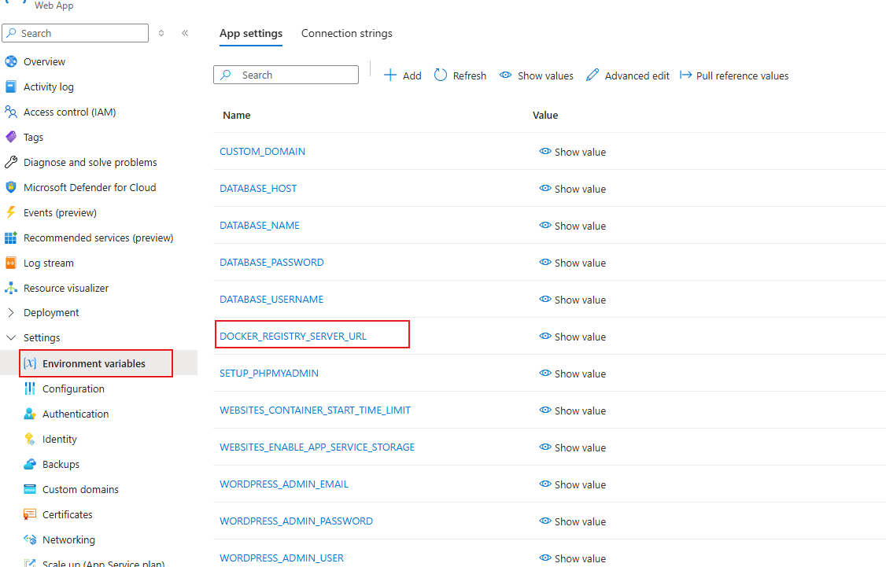

# Overview

This article provides steps for using a specific container image for WordPress to support custom configurations.

> **Note:** Using a specific image tag is not recommended, as it disables automatic platform updates for your WordPress image. We suggest allowing the platform to manage image updates for better maintenance, as outlined in the [Choosing the Right Image](../../README.md#2-choose-an-docker-image) section.

However, you may need to use a specific container image in cases like:
- Customizing the Docker image beyond the built-in startup script capabilities provided.
- Addressing a unique issue with your site by using an older or newer platform-provided image to mitigate specific edge-case scenarios.
- Comparing behavior between versions to troubleshoot site-specific issues and improve issue isolation.


## Platform-Supported Images

To view available WordPress Docker image tags, click [here](https://mcr.microsoft.com/v2/appsvc/wordpress-debian-php/tags/list).

## Prerequisites
- **Azure CLI**: Ensure [Azure CLI](https://learn.microsoft.com/en-us/cli/azure/install-azure-cli) is installed and configured.

   ```bash
   az upgrade
   az extension add --name webapp --upgrade --allow-preview true
   ```

## Updating the WebApp `LinuxFxVersion`

### For Linux

```bash
az account set -s $SUBSCRIPTION
az webapp config set --resource-group <wordpress-app-resource-group-name> --name <wordpress-app-service-name> --linux-fx-version "DOCKER|mcr.microsoft.com/appsvc/wordpress-debian-php:8.3_20241025.3.tuxprod"
```

### For Windows (Using PowerShell)

```powershell
az account set -s $SUBSCRIPTION
az --% webapp config set --resource-group <wordpress-app-resource-group-name> --name <wordpress-app-service-name> --linux-fx-version "DOCKER|mcr.microsoft.com/appsvc/wordpress-debian-php:8.3_20241025.3.tuxprod"
```

> The `--%` operator in PowerShell prevents special characters like `|` from being interpreted, so the command passes directly to Azure CLI.

To check your subscription ID if needed:

```bash
az account list --output table
```

### Optional: Change Docker Container Registry Server URL

> **Caution:** Changing the default registry server is not recommended, as it will affect WordPress support by us.

By default, the container registry server is set to Microsoft Container Registry, so no changes are needed for platform-specific images.

| URL                          | Registry Hub                          |  
|------------------------------|---------------------------------------|  
| Public Docker Hub            | https://index.docker.io/v1           |  
| Public Microsoft Container Registry (Recommended) | https://mcr.microsoft.com

Update the `DOCKER_REGISTRY_SERVER_URL` Environment variable of site as shown in screenshot below

