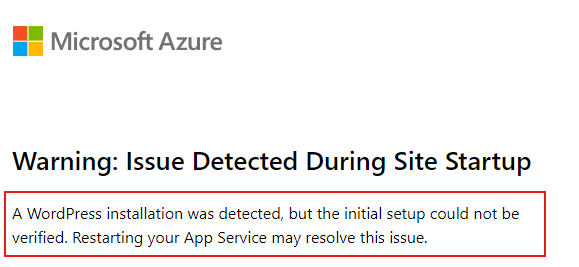

# Troubleshooting Guide for Existing WordPress Site Detected Warning

## Overview
If you see the following warning message on your WordPress site homepage:



This guide will explain the purpose of this warning and provide steps to resolve it yourself, with important notes on potential caveats.

## Why Am I Seeing This Warning?

This safeguard helps prevent potential data loss by warning the user instead of proceeding with a fresh installation that could overwrite existing MySQL data. However, the underlying cause of this issue is that the required WordPress files are missing from file storage, while the MySQL database already contains an existing WordPress installation.

In these cases, rather than risk data loss, the user is shown this warning page and you can easily diagnose the situation if you believe it’s a false alarm.

## Detailed Explanation
The WordPress LAMP stack was originally designed for single-machine hosting, but with cloud-native, containerized hosting, WordPress must support independent scaling and fault tolerance. To achieve this, WordPress directories are hosted on a remote file system. Occasionally, delays in retrieving the current state from the remote file system can cause WordPress to interpret it as a fresh installation, potentially leading to data loss if this warning mechanism is not in place. Typically, a site restart resolves this issue if it’s due to a temporary synchronization delay.

This situation can arise for various reasons, such as:

- **Remote Storage Not Mounted**: If `WEBSITES_ENABLE_APP_SERVICE_STORAGE` is set to false, the container won’t be connected to remote storage.
- **Accidental File Deletion**: Necessary files, like the deployment status file, may have been unintentionally deleted from file storage due to some manual actions.
- **Remote Storage or I/O Failures**: Issues with remote storage mounting or I/O operations could prevent the system from detecting these files, often due to platform-level synchronization delay errors.

This is a warning, not an error, and you can proceed with resolving it if you’re familiar with your site setup.

## Troubleshooting Steps

### 1. Restart the Site
   First, try restarting your site and wait a few minutes to check if the issue resolves. If the warning still appears after 2-3 restarts, continue with the steps below, as this often resolves transient issues.

### 2. Check `WEBSITES_ENABLE_APP_SERVICE_STORAGE` Setting 
   Verify that the `WEBSITES_ENABLE_APP_SERVICE_STORAGE` app setting is set to `true`, as explained [here](../wordpress_application_settings.md).

### 3. Verify Required WordPress Deployment Status Files

#### 3.1 Access the Kudu Dashboard
   Open the Kudu dashboard for your App Service by going to `https://<appname>.scm.azurewebsites.net/`. For an introduction to Kudu, refer to [this blog post](https://techcommunity.microsoft.com/blog/appsonazureblog/kudu-dashboard-explained---wordpress-on-app-service/4030035).

#### 3.2 Open the BASH Console
     In the Kudu dashboard, select the "BASH" option.

#### 3.3 Check Deployment Status
Run the following command to check the WordPress deployment status:

```bash
cat /home/wp-locks/wp_deployment_status.txt 
```

**Sample Expected Output**:

```text
PHPMYADMIN_INSTALLED
WORDPRESS_PULL_COMPLETED
WP_INSTALLATION_COMPLETED
WP_CONFIG_UPDATED
SMUSH_PLUGIN_INSTALLED
EMAIL_PLUGIN_INSTALLED
SMUSH_PLUGIN_CONFIG_UPDATED
W3TC_PLUGIN_INSTALLED
W3TC_PLUGIN_CONFIG_UPDATED
BLOB_STORAGE_CONFIGURATION_COMPLETE
WP_LANGUAGE_SETUP_COMPLETED
WP_TRANSLATE_WELCOME_DATA_COMPLETED
FIRST_TIME_SETUP_COMPLETED
BLOB_CDN_CONFIGURATION_COMPLETE
BLOWFISH_SECRET_UPDATED
```

#### 3.4 Confirm WordPress Installation Status File Presence  
If `/home/wp-locks/wp_deployment_status.txt` is missing, the setup may be complete, but a transient issue has occurred. Additionally, check the MySQL database for any existing WordPress data. A site restart may help in such cases.

#### 3.5 Verify Installation Status
If the file is present but missing entries like `WORDPRESS_PULL_COMPLETED` or `WP_INSTALLATION_COMPLETED`, the installation may be incomplete. To verify, use the WP CLI command:

```bash
wp core is-installed --path=/home/site/wwwroot --allow-root
```

Refer to [this guide](../how_to_use_wpcli_tool.md) for detailed instructions. Run the command in the "SSH" tab on the Kudu dashboard as it needs to execute within the container context.

#### 3.6 Manual File Update (If Needed)
If WordPress installation is confirmed, you can manually update or recreate the status file to resolve the warning. Use the following commands:

```bash
touch /home/wp-locks/wp_deployment_status.txt
echo "WORDPRESS_PULL_COMPLETED" >> /home/wp-locks/wp_deployment_status.txt
echo "WP_INSTALLATION_COMPLETED" >> /home/wp-locks/wp_deployment_status.txt
```

Optionally, replace this with the full sample output from above or restore from a recent working backup of your deployment status file.

#### 3.7 Restart the Site Again after updating status file
Restart the WordPress App Service. The warning should now be resolved.

By following these steps, you should be able to resolve the warning effectively.

If the issue persists, please contact our [official support channels](../../README.md#-community-and-support) with relevant information, such as your Azure App Service ARM Resource ID. You may also need to consult Azure Storage support if the issue involves snapshot and restore functionality.