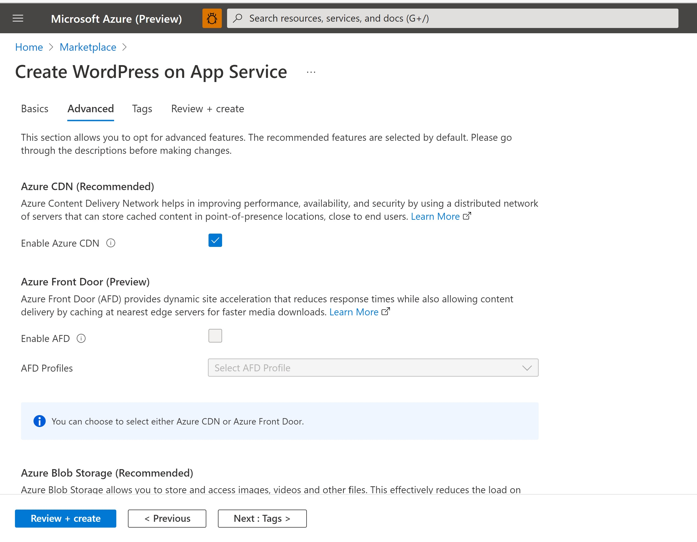
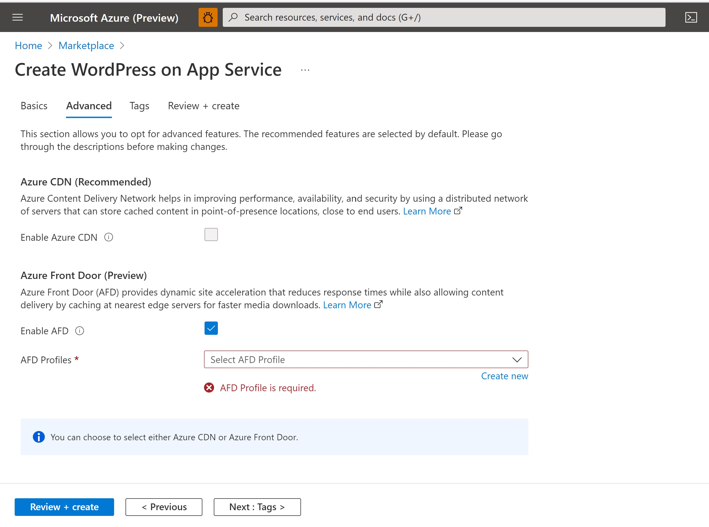
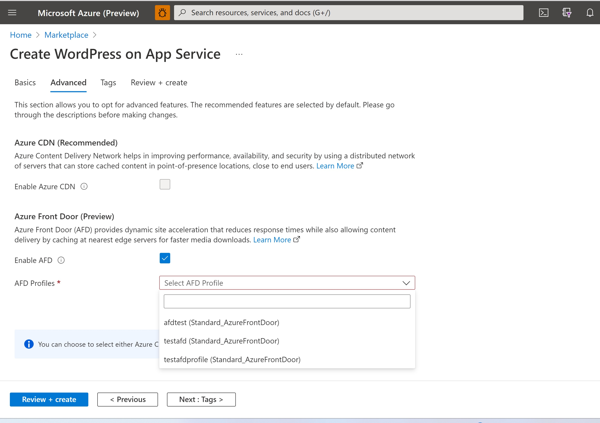

# How to use Azure Front Door (AFD) with WordPress on Azure App Service?

Azure Front Door is a modern cloud content delivery network (CDN) service that delivers high performance, scalability, and secure user experiences for your content and applications. Learn More.

WordPress on Azure App Service now supports AFD. This improves performance of apps by delivering your content using Microsoft's global edge network with hundreds of global and local points of presence. Access to the static and dynamic content of your WordPress application is accelerated by caching static content at the edge server and using split TCP method to reduce connection establishment time among others.

## How it works?

For a Linux WordPress deployment with AFD enabled, a new AFD endpoint is created along with an origin group for the app service in the selected Profile. The AFD endpoint hostname is passed to the app services as an app setting which is used configure AFD in WordPress.

The following Application Settings are passed on to the Web App during the deployment in order to configure Azure Front Door in WordPress.  

|Application Settings | Value |
|---------------------|-------|
|AFD_ENABLED | <true/false>     |
|AFD_ENDPOINT | <AFD_Endpoint_Hostname>   |


When AFD endpoint comes up, **WP_HOME** and **WP_SITEURL** constants are updated in wp-config file. This updates the domain of all hyperlinks produced by WordPress to AFD endpoint hostname and redirects all admin pages to AFD.

**NOTE**: It may take up to 15 minutes or more in case of app restarts to configure AFD since it leads to a reset of the cron job that configures AFD.

Front Door acts as a reverse proxy for WordPress on Azure App Service and in the entry point to the application. So when user makes a request, it is served by the nearest edge server (following anycast method) which in turn retrieves the response from app service and returns back to the user.

AFD is configured to cache and compress static content at the edge server for 3 days unless 'cache-control: private' header is present in response. You can look at the rule-set created in AFD profile for details.

For a Linux WordPress deployment with AFD and Blob Storage enabled, an additional origin group is created for blob container used to host WordPress uploads. The rules created during deployment is updated to override origin group to blob container for uploads (wp-content/uploads). Learn More about WordPress with Blob Storage.

## Deploy to an existing AFD Profile

You can deploy AFD resources to an existing AFD profile in addition to creating a new profile. Deploying to an existing AFD profile helps in sharing the cost associated with AFD profile across resources. Currently, only AFD Standard SKU is supported with WordPress deployment.

Configuring AFD with WordPress

1. From the [WordPress Create page](https://ms.portal.azure.com/#create/WordPress.WordPress), navigate to the Advanced tab. Default Azure CDN will be selected and AFD is shown in disabled mode as shown in the below screenshot:



2. Select Enable AFD check box


3. You can either select an existing AFD profile (Standard SKU) from the dropdown or create a new profile as shown below


4. Go to Review and Create Tab and choose Create to deploy the WordPress

## Custom Domain
1. Add the custom domain to your Azure Front Door resource by following the steps in this documentation [Configure a custom domain with AFD](https://learn.microsoft.com/en-us/azure/frontdoor/standard-premium/how-to-add-custom-domain). Because Azure Front Door is the entry point for your WordPress application, you should add a custom domain to it and not to the App Service.
2. Then add the following Environment variable (App setting) to your App Service. Do not add **https://** or **http://** prefix when adding the custom domain value in the below App Setting. It should be just your domain name (ex: _contoso.com_).

    ```bash
    CUSTOM_DOMAIN: <Custom_Domain> 
    ```

## Purge AFD cache
When you deploy updates to existing files in your WordPress app, Azure Front Door may continue to serve older versions of your files until their time-to-live expires. Purge the Azure Front Door cache for the affected paths to ensure the latest files are served. Follow this guide for steps to purge AFD cache for an AFD endpoint.

## Resources Deployed
WordPress with AFD enabled deploys the following resources to AFD profile
- AFD Endpoint
- AFD Route
- Origin group
- Rule-set (2 Rules)
    - First rule defines caching and compression behavior for wp-content/uploads files and the origin source (blob storage / app service).
    - Second rule defines caching and compression behavior for other static files of specific extension.
