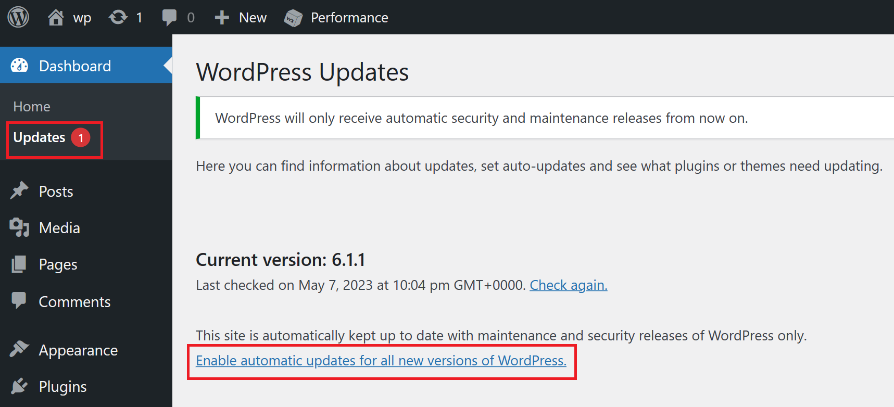
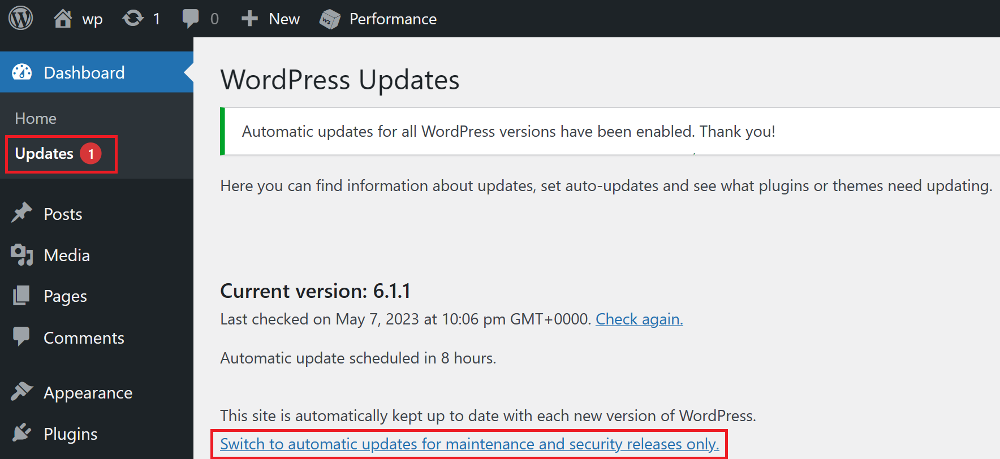

# WordPress core auto-updates

WordPress core auto-updates is one of the most important features of WordPress because it helps to ensure the security and stability of the platform. WordPress is constantly evolving and improving, and new updates are released regularly to address security vulnerabilities, fix bugs, and improve performance.

By automatically updating the WordPress core software, website owners can ensure that their website is always running on the latest version of the platform. This helps to protect the site from security vulnerabilities and other issues that could impact the performance of the site.

By default, **WordPress on App Service** enables auto updates of WordPress core minor version and disables major version updates to avoid potential bugs or incompatibilities with plugins or themes. Minor version updates are necessary for keeping the site up to date with security fixes and maintenance updates. With these settings, WordPress regularly checks for a new minor version every 2 hours and updates to the latest version if available.


## How do I enable WordPress core major updates? 

To enable WordPress core major updates, go to the Updates section in WordPress admin dashboard of your site and click on "Enable automatic updates for all new versions of WordPress" link as shown below.



Once you click on this link and enable WordPress core auto updates, you can go back to enabling only WordPress core minor updates by clicking the "Switch to automatic updates for maintenance and security releases only." link on the same page as shown below.



In case you are unable to see such links in Updates section of WordPress admin, you can add the following to wp-config.php file:
```
define( 'WP_AUTO_UPDATE_CORE', minor);
```
***NOTE:*** Setting this constant to 'minor' will enable only minor version auto-updates. You can change this using the link from Updates section as described before.

To edit wp-config.php file, follow these steps:

1. Navigate to webssh of your app service through this link <app service name>.scm.azurewebsites.net/webssh/host

2. Edit wp-config.php file with vi/vim editors using the following command
```
vi /home/site/wwwroot/wp-config.php
```
3. Add this line and save the file
```
define( 'WP_AUTO_UPDATE_CORE', minor);
```
