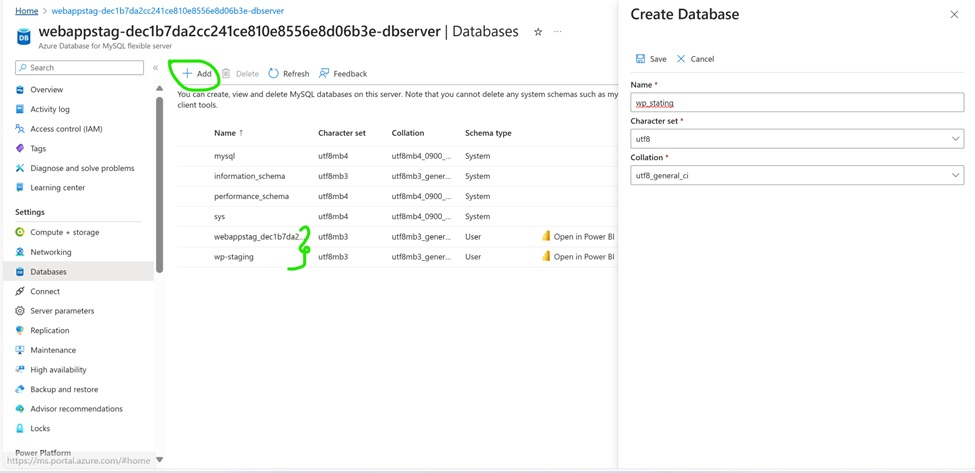
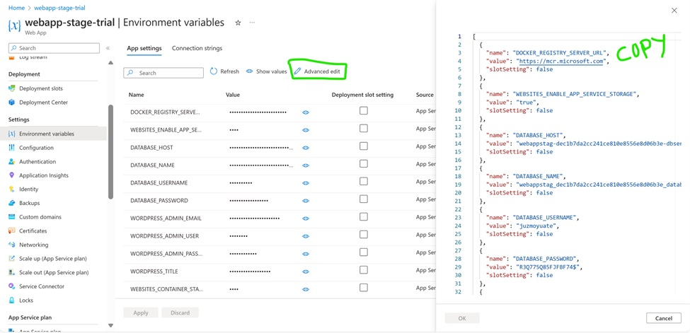
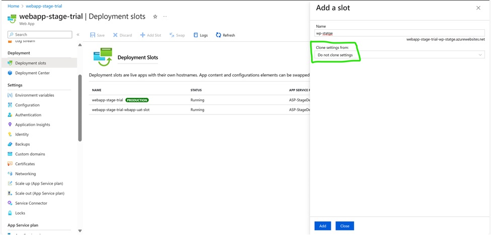
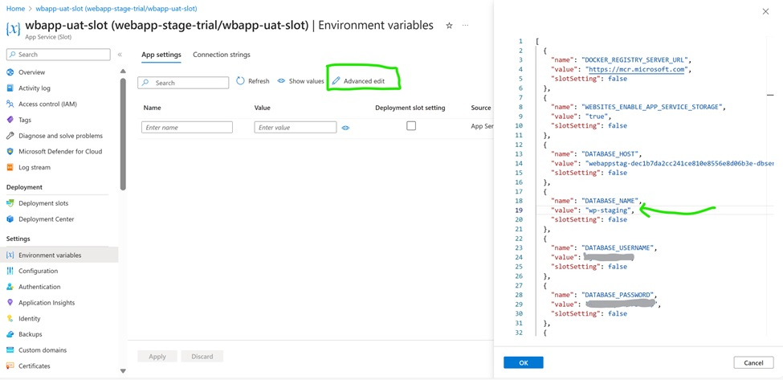
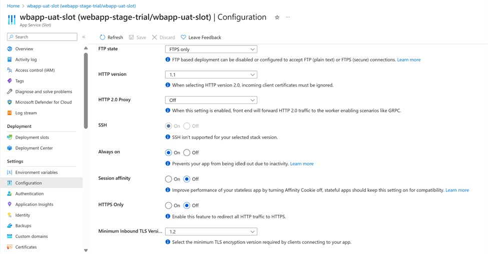

# WordPress on Azure App Service - Stage Deployments

Azure App Service Deployment Slots are a feature of Azure App Service that allow you to create multiple deployment environments for your web applications. They are extremely useful for various scenarios, such as:

* Development and Testing: You can have separate slots for development, staging, and testing your web app without affecting the production environment. This allows you to validate changes before making them live.

- Blue-Green Deployments: You can set up a production slot and a staging slot. When you're ready to release a new version, you can swap the slots, making the staging slot the new production slot. This enables zero-downtime deployments.

- A/B Testing: You can create multiple slots to test different versions of your application with a portion of your user base, allowing you to gather feedback and make informed decisions.

- Rollback: If a new deployment causes issues, you can easily swap the slots back to the previous version, quickly rolling back changes

Leveraging the power of Stage deployments of App Service, we can easily manage the content updates, plugin modifications, version upgrades of WordPress sites without impacting the end users.  As WordPress on App Service also has a Azure MySQL Flexible server database backend, you need to have a configuration for setting up production and stage databases aligning to your Web servers(App Service).  Since Azure MySQL Flexible server do not have feature similar to App Service deployment slots, you need to follow certain customizations to maintain Product and Stage slots for WordPress sites. 


**Note:** To learn more on Deployment Slots and how stage deployment slots works in App Service, you an refer to the documentation in [learn.microsoft.com]( https://learn.microsoft.com/en-us/azure/app-service/deploy-staging-slots?tabs=portal)

## Steps to configure Stage Slots:

1. Create WordPress on Azure App Service from Azure marketplace offering : [Create WordPress on App Service - Microsoft Azure](https://ms.portal.azure.com/#create/WordPress.WordPress)

2. Once the WordPress resources are created, navigate to MySQL resource and create a new database with the name having a suffix  _staging on same database server



3. Now go to App Service Resource. Copy the Application Settings from the production App slot to a text editor. We will need to edit and add these settings to the staging slot later.



4. Create a new staging slot for App Service as shown in the below screenshot:



5. We must now connect the staging App Service to the existing Virtual Network (App Subnet). You can configure it from the Networking tab of your staging App Service:


6. Now go to the text editor where you have previously copied Application Settings from the production slot in step 3. Update the DATABASE_NAME application settings with the new staging database created in step 2.

7. If you intend to use Azure Blob Storage/Azure CDN/Azure Front Door in the staging environment, update their new values accordingly. Otherwise, remove the corresponding app settings. Once you've finished editing, copy these new Application Settings to the staging slot as shown below and save the changes. 



8. Navigate to Overview blade and launch the URL from Default Domain parameter. Th WordPress site on Stage slot will be setup pointing to stage database. 

9. Once the WordPress site is installed successfully, enable the ‘Always On’ flag in the Configurations.



With this Your site is configured with 2 deployment slots – Productions and Staging successfully configured. As you start configuring your setup with these deployment slots, there are certain best practices to be followed:

## Database Management:

- Since we have 2 different database instances pointing to Production & Staging, you can continue to make the changes to the 2 instances independently.   The Slot that is in active use (ex: Production slot) will have more frequent database updates.

- So Always ensure that you have copied database from production to staging first before  making any code changes.

- You can use [phpMyAdmin](https://<sitename>.azurewebsites.net/phpmyadmin/) following the steps described [here](https://stackoverflow.com/questions/16481083/how-can-i-duplicate-a-database-using-phpmyadmin) or MySQLDump to copy the data from Production DB to staging DB. 

- Once the data is copied from production to staging, Turn Off Invisible Primary Key Generations.  Go to your Azure MySQL server -> Server parameters -> All -> search for ‘sql_generate_invisible_primary_key’ -> set the value to OFF -> click on Save.

- Replace the values of production domain name in the database with staging domain name. To do this, you can use [WP CLI Documentation](https://developer.wordpress.org/cli/commands/search-replace/).

- You can use WP CLI tool from SCM site of your staging App Service which can be accessed from the URL: ** https://<appname>-staging.azurewebsites.net/newui/webssh. ** Replace the placeholder values with your stage app name. You can do a dry run using the ‘--dry-run’ flag.

```
wp search-replace '<PRODUCTION_DOMAIN_NAME>' '<STAGING_DOMAIN_NAME>' --all-tables --path=$WORDPRESS_HOME --allow-root
```

- If your WordPress site is configured with Multisite, then you must add ‘--network’ and ‘--url’ flags. For more information on search & replace functionality of wp-cli tool, please refer to the [WP CLI Documentation](https://developer.wordpress.org/cli/commands/search-replace/)

## Managing Storage Accounts:

- There should be seperate Blob container is configured with each slot to avoid any conflicting updates.

- Recommendation is first copy the data from Production to Stage slot, then perform any additional updates as needed. 

- To sync the data from one container to another, we can use the [az blob storage](https://learn.microsoft.com/en-us/cli/azure/storage/blob/copy?view=azure-cli-latest#az-storage-blob-copy-start-batch) copy command as given below. 

```
az storage blob copy start-batch --account-key <account-key> --account-name <account-name> --destination-container <destination-container> --source-container <source-container>
```

- You can also use [azcopy sync](https://learn.microsoft.com/en-us/azure/storage/common/storage-ref-azcopy-sync) command line tool.

## Managing Code

- It is always recommended to make the changes first on Staging slot and then you can swap

- Use environment variables for storing configuration settings in each deployment slot. Using slot-specific environment variables simplifies configuration management.

- Use CI/CD pipelines as relevant to modify the plugins/ themes as needed.  How to configure [CICD with App Service](https://learn.microsoft.com/en-us/azure/app-service/deploy-continuous-deployment?tabs=github)

- Use traffic routing features to gradually route traffic to a new slot. This can help you validate the new version's performance and functionality with a subset of users before making it the production version.
