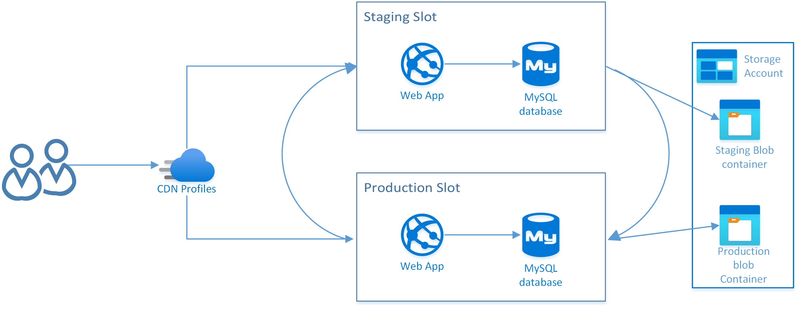
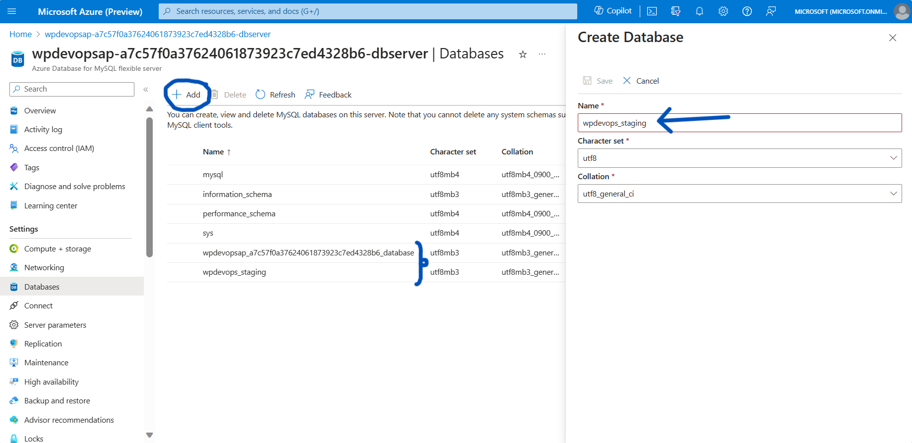
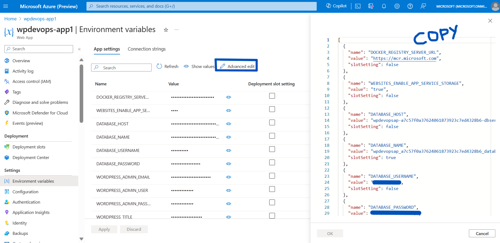
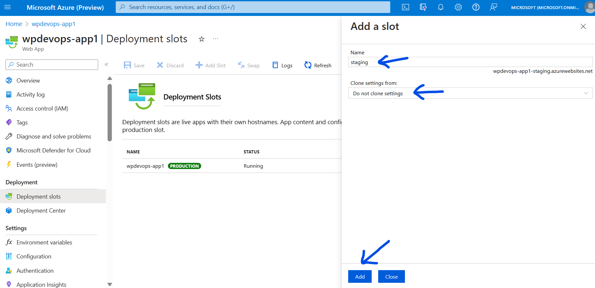
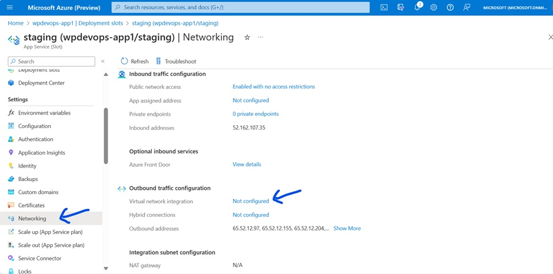
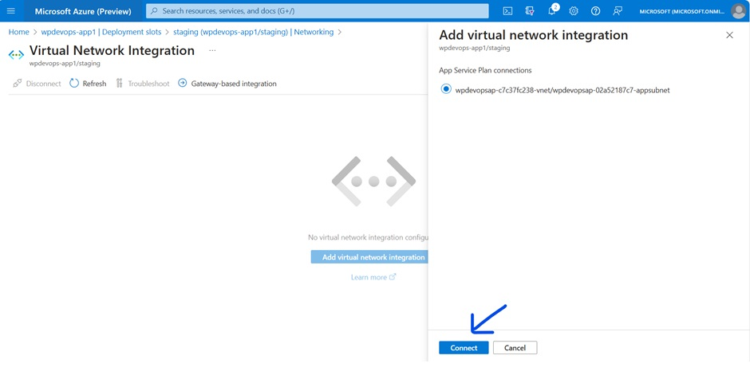
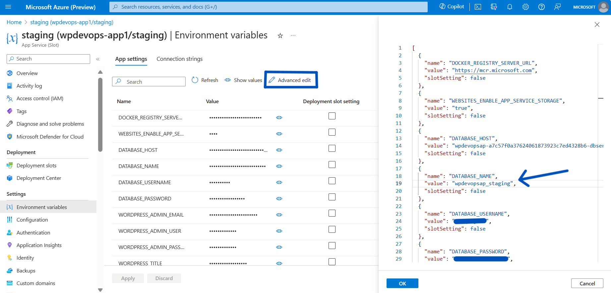
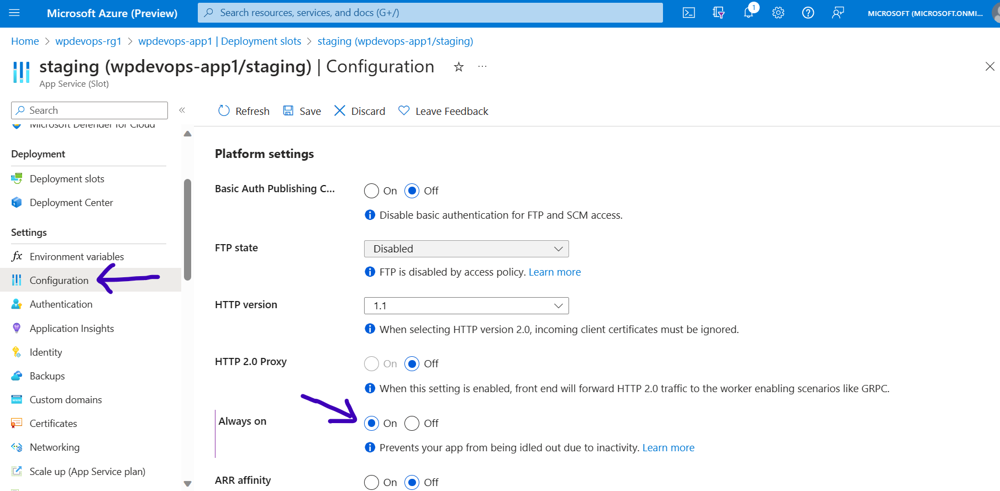

# WordPress on Azure App Service - Stage Deployments

The Deployment Slots feature of Azure App Service allows you to create multiple environments for your web applications. They are extremely useful for various scenarios, such as:

- Development and Testing: You can have separate slots for development, staging, and testing your web app without affecting the production environment. This allows you to validate changes before making them live.

- Blue-Green Deployments: You can set up a production slot and a staging slot. When you're ready to release a new version, you can swap the slots, making the staging slot the new production slot. This enables zero-downtime deployments.

- A/B Testing: You can create multiple slots to test different versions of your application with a portion of your user base, allowing you to gather feedback and make informed decisions.

- Rollback: If a new deployment causes issues, you can easily swap the slots back to the previous version, quickly rolling back changes.

Leveraging the power of stage deployments of App Service, we can easily manage the content updates, plugin and theme modifications, version upgrades of WordPress, and much more without impacting the end users. Since WordPress on App Service also makes use of Azure MySQL Flexible Server database, you must setup production and staging databases that corresponds to your respective deployment environments (slots). Because Azure MySQL Flexible Server does not have features similar to App Service deployment slots, you must perform certain customizations to maintain production and staging slots for WordPress sites. 



**Note:** To learn more about deployment slots and how stage deployments works in App Service, you can refer to the following documentation - [Creating Staging Environments in Azure App Service]( https://learn.microsoft.com/en-us/azure/app-service/deploy-staging-slots?tabs=portal)

## Steps to configure staging slot

1. Create WordPress on Azure App Service from the Azure marketplace offering : [Create WordPress on App Service - Microsoft Azure](https://ms.portal.azure.com/#create/WordPress.WordPress)

2. Once the WordPress resources are created, navigate to the Azure MySQL Server resource used by the production environment and create a new database for staging environment. You can name the new database with a suitable suffix, such as "_staging".



3. Now go to App Service resource and copy the Application Settings from the production App slot to a text editor. We will need to edit and add these settings to the staging slot later.



4. Create a new staging slot for App Service with 'Do not clone settings' option, as shown in the below screenshot:



5. We must now connect the staging App Service to the existing Virtual Network (App Subnet). You can configure it from the Networking tab of your staging App Service:





6. Now go to the text editor where you have previously copied Application Settings from the production slot in step (3). Update the DATABASE_NAME application settings with the new staging database created in step (2).

7. If you intend to use Azure Blob Storage/Azure CDN/Azure Front Door in the staging environment, update their new values accordingly. Otherwise, remove the corresponding app settings. Once you've finished editing, copy these new Application Settings to the staging slot as shown below and save the changes. 



8. Navigate to Overview blade of staging slot and launch the URL shown with 'Default domain' label. The WordPress site on staging App slot will be setup pointing to the staging database. 

9. Once the WordPress site is installed successfully, enable the ‘Always On’ flag in the Configurations.



With this, your site is configured with two deployment slots: production and staging. As you start configuring your setup with these deployment slots, there are certain best practices to be followed, as outlined below.


## Database Management

- Since the production and staging environments have different databases, we can make the changes to these instances independently. Due to live data, the production slot will update the database more often and will go out of sync with staging database.

- Always ensure that the database is copied from production to staging and never the other way around. Copying from staging to production can result in potential data loss. Only do so if you are fairly certain about it.

- Database changes should be included within the code being added. For example, a newly added plugin is supposed to take care of creating its own tables (if any) within its code.

- Please ensure that invisible primary key generation setting is turned off for your MySQL database server. Go to your Azure MySQL server -> Server parameters -> All -> search for ‘sql_generate_invisible_primary_key’ -> set the value to OFF -> click on Save.

- To copy the database from production to staging, you can use [phpMyAdmin](./wordpress_phpmyadmin.md) by following the steps described [here](https://stackoverflow.com/questions/16481083/how-can-i-duplicate-a-database-using-phpmyadmin). Or, you can install and use **mysqldump** cli tool from SCM site of your staging App Service: `https://<appname>-staging.azurewebsites.net/newui/webssh`.
    ```
    mysql -h $DATABASE_HOST -u $DATABASE_USERNAME --password=$DATABASE_PASSWORD -e 'DROP DATABASE staging_db;'
    mysql -h $DATABASE_HOST -u $DATABASE_USERNAME --password=$DATABASE_PASSWORD -e 'CREATE DATABASE staging_db;'
    mysqldump -h $DATABASE_HOST -u $DATABASE_USERNAME --password=$DATABASE_PASSWORD production_db | mysql -h $DATABASE_HOST -u $DATABASE_USERNAME --password=$DATABASE_PASSWORD staging_db
    ```

- After copying the database replace the values of production domain name in the database with staging domain name. To do this, you can use [WP CLI Tool](./how_to_use_wpcli_tool.md) from SCM site of your staging App Service which can be accessed from: `https://<appname>-staging.azurewebsites.net/newui/webssh`. Replace the placeholder values with your staging app name. You can do a dry run using the ‘--dry-run’ flag. 
    ```
    wp search-replace '<PRODUCTION_DOMAIN_NAME>' '<STAGING_DOMAIN_NAME>' --all-tables --path=$WORDPRESS_HOME --allow-root
    ```
    **Note:** If your WordPress site is configured with Multisite, then you must add ‘--network’ and ‘--url’ flags. For more information on search & replace functionality of wp-cli tool, please refer to the [WP CLI Documentation](https://developer.wordpress.org/cli/commands/search-replace/)


## Managing Code

- Mantain seperate branches for each slots.

- Code changes should always flow from the staging environment to the production environment, and not the other way around. And it is always recommended to first make the changes on staging slot and then on production.

- Database changes should be included within the code being added. For example, a newly added plugin is supposed to take care of creating its own tables (if any) within its code.

- Use CI/CD pipelines as relevant to deploy the code changes to each of the slots from their respective branches. For more information refer: [Enablin CI/CD with WordPress on App Service](./wordpress_azure_ci_cd.md) 


## Managing Blob Storage

- Use separate blob containers for each of the App Service deployment slots to avoid conflicting or accidental updates.

- It is generally recommended to copy data only from production to staging environment, and not the other way around. Only do so if you are fairly certain about it.

- To sync the data from one container to another, we can use the [az blob storage copy](https://learn.microsoft.com/en-us/cli/azure/storage/blob/copy?view=azure-cli-latest#az-storage-blob-copy-start-batch) command as given below. You can also use [azcopy sync](https://learn.microsoft.com/en-us/azure/storage/common/storage-ref-azcopy-sync) cli tool.
    ```
    az storage blob copy start-batch --account-key <account-key> --account-name <account-name> --destination-container <destination-container> --source-container <source-container>
    ```
