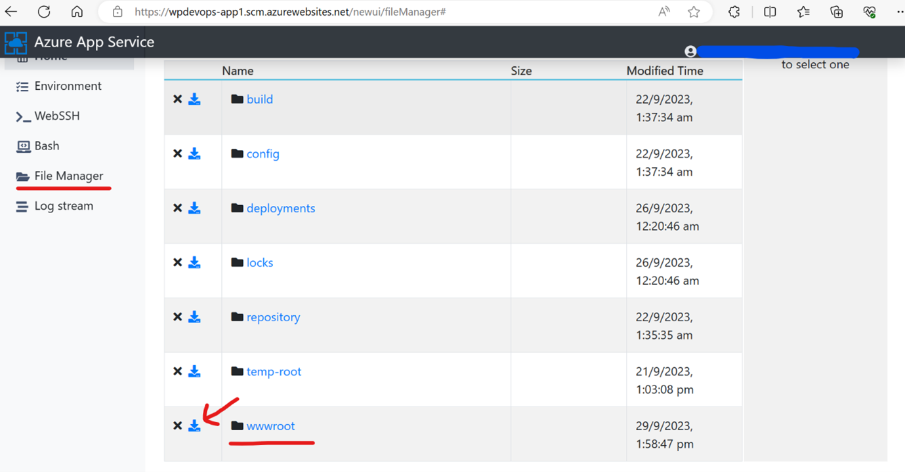
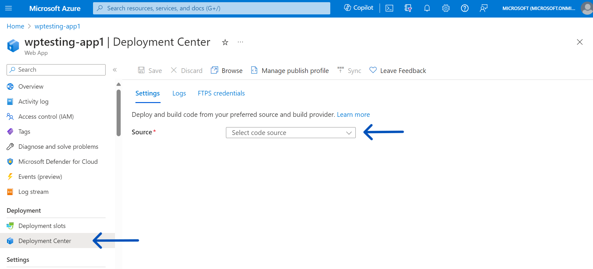
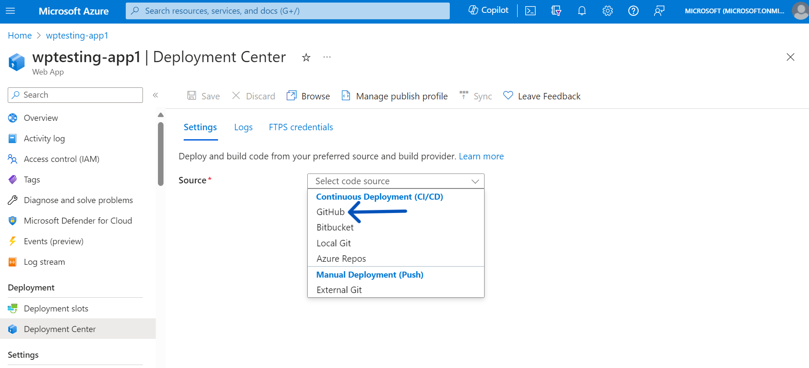
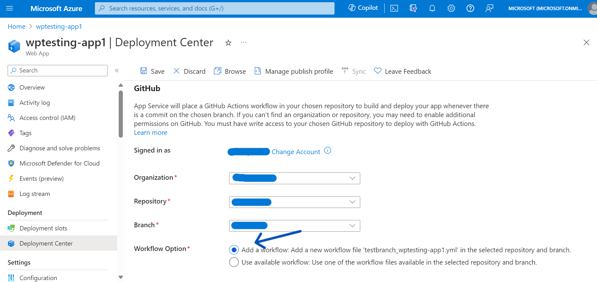
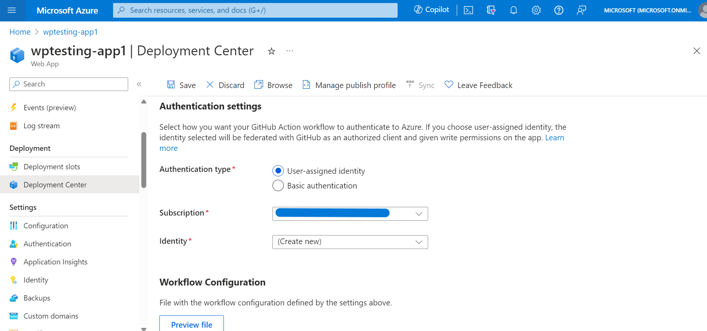
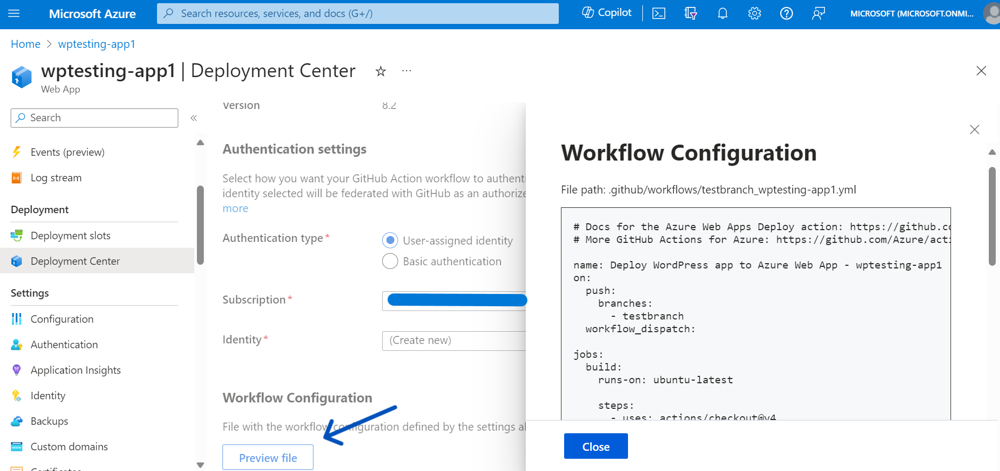
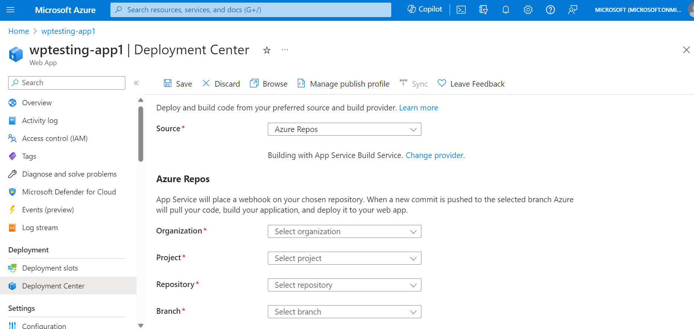

# Enabling CI/CD with WordPress on App Service

The code integration feature is currently enabled with WordPress images having  [tags](https://github.com/Azure/wordpress-linux-appservice/tree/main?tab=readme-ov-file#image-details) of 8.2 or greater. It will soon be available for the remaining supported [tags](https://github.com/Azure/wordpress-linux-appservice/tree/main?tab=readme-ov-file#image-details). You should see a code integration view in the Deployment Center blade of your App Service if it is supported for your image version.

### Which files to track using VCS?
---
Before integrating code with Version Control platforms, it is important to decide which files to include and which to exclude. It is always recommended that you keep track of as few files as possible. For example, keeping track of the **wp-content/uploads** folder will be inefficient because it contains static media files that can be quite large. Instead, the uploaded data should be stored in an Azure blob storage. 

It is also widely preferred to ignore WordPress core files as they change less frequently, and core upgrades can be performed independently on each of the environments. You can also ignore the **wp-config.php** file as configurations usually differ between production and development environments. However, it is up to the users to decide whether it is necessary to keep track of them. We must also ignore temporary files and directories, such as, _wp-content/advanced-cache.php, wp-content/object-cache.php, wp-content/cache/, wp-content/upgrades/ etc.,_ 

A sample **[gitignore](./files/gitignore)** file is provided below to help you get started.
```
*~
*.log
.htaccess

wp-content/uploads/
wp-content/upgrade/
wp-content/cache/
wp-content/backups/
wp-content/backup-db/
wp-content/blogs.dir/

wp-content/advanced-cache.php
wp-content/object-cache.php
wp-content/wp-cache-config.php
sitemap.xml
sitemap.xml.gz

# Note: if you want to track WP core files, you can delete this section
/wp-admin/
/wp-content/index.php
/wp-content/languages
/wp-content/plugins/index.php
/wp-content/themes/index.php
/wp-includes/
/index.php
/license.txt
/readme.html
/wp-*.php
/xmlrpc.php

# Configuration - remove this if not required
wp-config.php

```

**Reference**: https://github.com/github/gitignore/blob/main/WordPress.gitignore
<br><br>

### Downloading WordPress code from App Service
---
- Go to the SCM site of your App Service using the following URL: https://**\<sitename\>**.scm.azurewebsites.net/newui/fileManager

- Navigate to *site* folder in File Manager and download the *wwwroot* folder as a zip file as show below.

- Extract the zip file, decide what code needs to be integrated with git, and push it to the remote repository.

    

<br>

### Enabling CI/CD with GitHub
---
1. Go to **Deployment Center** on your App Service dashboard.

    

2. From the dropdown, select 'GitHub' as the source provider.

    

3. Select the repository and the branch from which you want to integrated the code. Select 'Add a workflow' under Workflow options.

    

4. Under **Authentication Settings**, select User-assigned identity as authentication type. Note that you can also use basic authentication, but it is not recommended. 

    

5. Click on 'Save' button shown at the top.

6. You can also preview the workflow file configuration by clicking on the 'Preview file' option shown at the bottom.

    

<br>

### Enabling CI/CD with Azure Repos
---
1. Go to **Deployment Center** on your App Service dashboard. From the dropdown, select 'Azure Repos' as the source provider.

    

2. Select the organization, project, repository and branch from which you want to integrated the code. Then click on 'Save'.

    

<br>

### Important Notes
---
- Previously, the image details could be viewed or updated from the 'Deployment Center' section. However, it would now show only the code integration view. In the near future, image upgrade option would be available under **Settings -> Configuration -> Stack Setting** section.

- Meanwhile, if you are looking at updating the image details of your App Service, you can do it via **[az cli](https://learn.microsoft.com/en-us/cli/azure/webapp/config?view=azure-cli-latest#az-webapp-config-set)**. Below are the commands to update linux-fx-version of App Service. Replace the place holders SUBSCRIPTION_ID, RESOURCE_GROUP_NAME, WEBAPP_NAME with actual values.

    ```
    az login
    az account set --subscription SUBSCRIPTION_ID
    az webapp config set --name WEBAPP_NAME --resource-group RESOURCE_GROUP_NAME --linux-fx-version "DOCKER|mcr.microsoft.com/appsvc/wordpress-alpine-php:8.3"
    ```
- You can also update the image details of the App Service using the [REST interface](https://learn.microsoft.com/en-us/rest/api/appservice/web-apps/create-or-update-configuration?view=rest-appservice-2022-03-01#code-try-0) and use the following json as body. You also need to specify the app name, resource group name and subscription in the parameters section.

    ```
    {
        "properties": {
            "linuxFxVersion": "DOCKER|mcr.microsoft.com/appsvc/wordpress-alpine-php:8.3"
        }
    }
    ```
