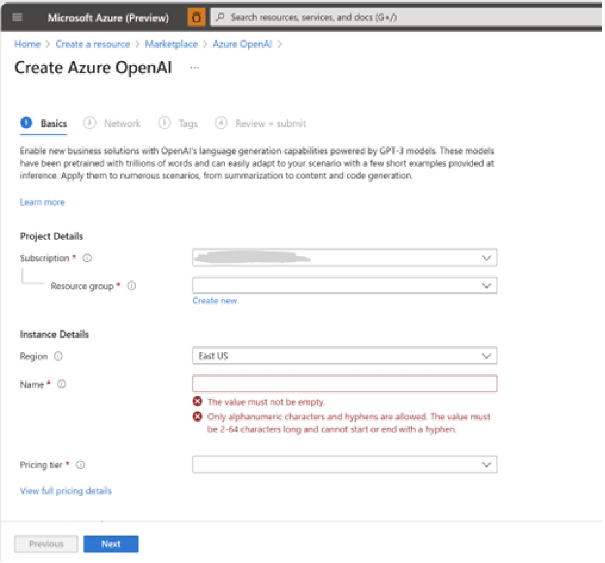
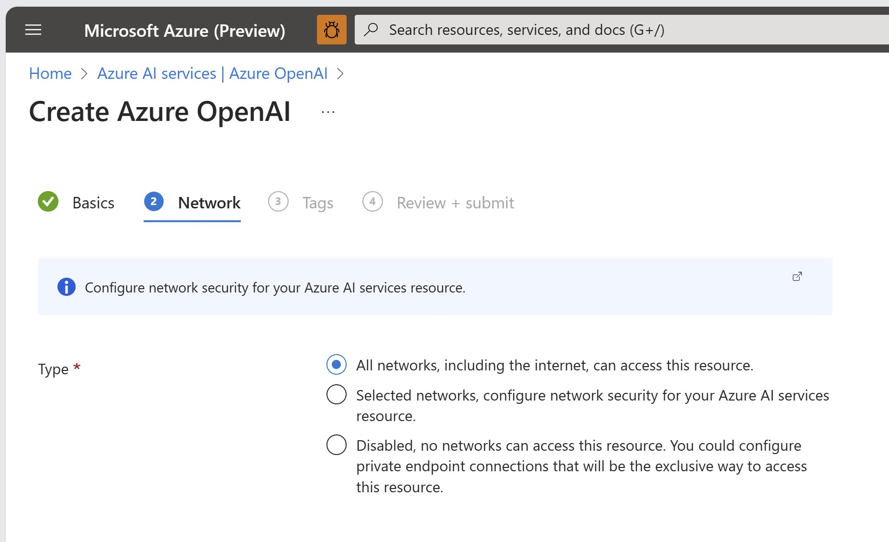
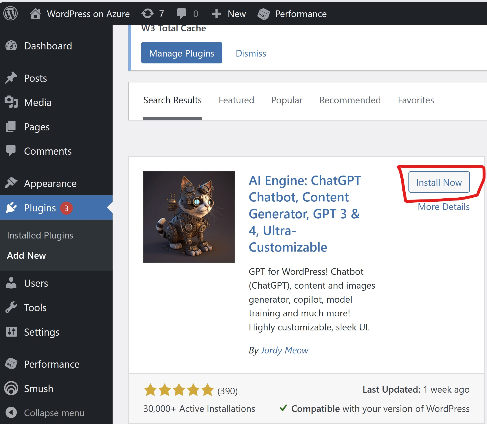
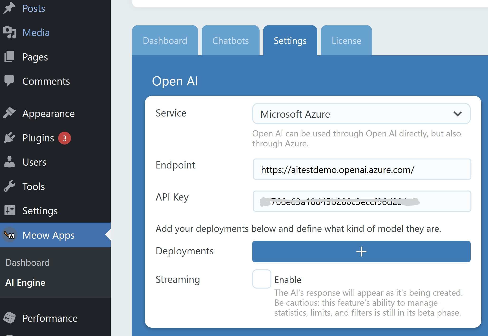
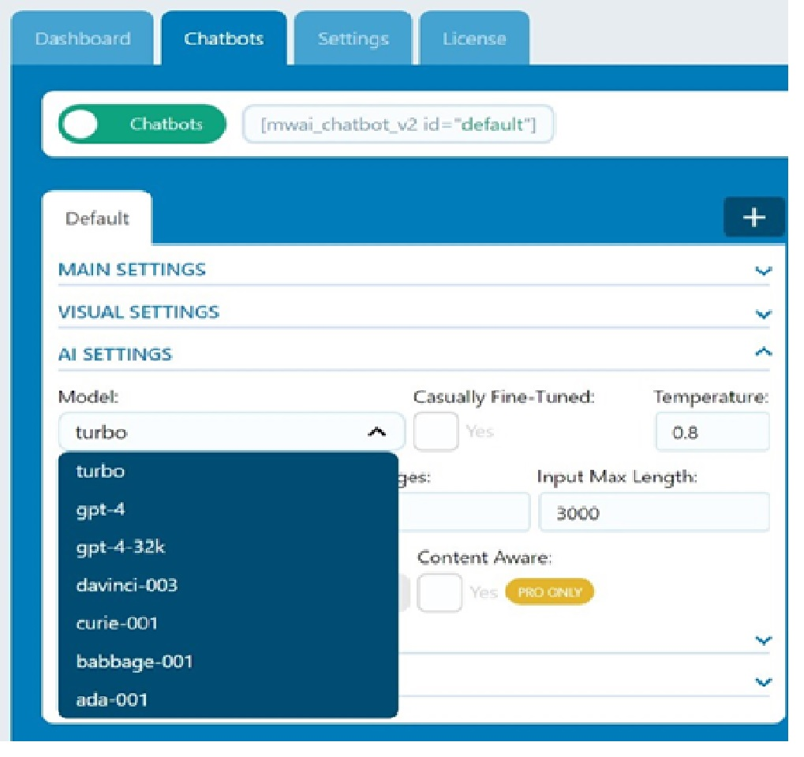
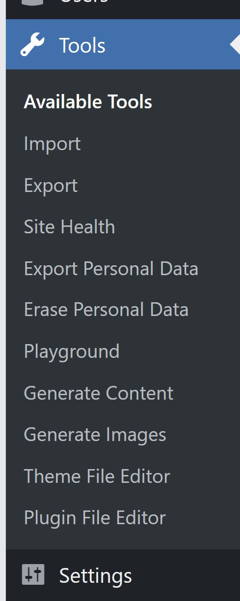
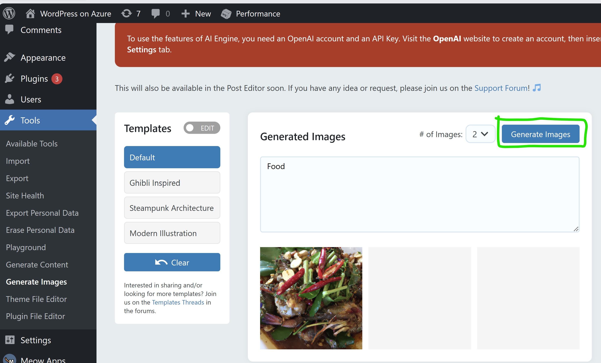
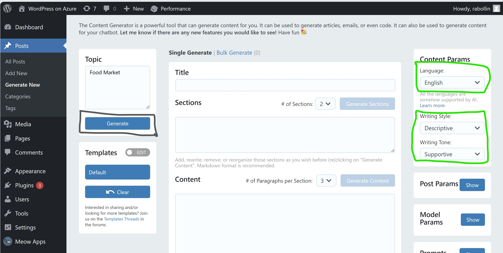
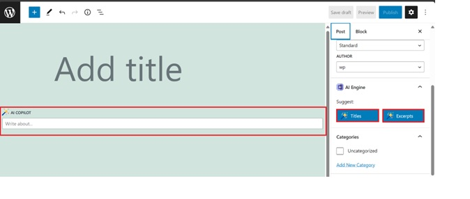

# WordPress on Azure App Service – Simplify site creation with Azure OpenAI

AI models can provide significant benefits to WordPress content generation by analysing vast amounts of data and generate high-quality content automatically. This can save content creators time and effort by automating repetitive and time-consuming tasks such as keyword research, topic selection, writing blog drafts or image generation.

AI chat models can help content creators optimize their content for search engines by suggesting relevant keywords and identifying gaps in existing content. By leveraging AI chat models, WordPress site owners can create more content in less time, improve the quality of their content, and ultimately drive more traffic to their site. Additionally, they can enhance the user experience by offering instant assistance to visitors who have questions or need help navigating through the site. This can improve customer satisfaction and increase engagement on the site.

This document explains how to configure Azure Open AI with WordPress on Azure AppService. With this integration you can enable:

    1. Content/ Posts generation 
    2. Translation of the content the language of your choice
    3. Content proof reading/ polishing the content for grammatical correctness 
    4. Image Generation based on the subject/topic.
    5. Search for content within website 

**Prerequisite**:  Create Azure Open AI resource from Azure Portal

1. In Azure Portal – navigate to Create resource and search for Open AI resource
2. Create Open AI resource, the screen looks as follows:
   

You will need to provide the following information: 

    •Subscription: Select the Azure subscription associated with your OpenAI onboarding application.  
    •Resource Group: Choose an existing resource group or create a new one to contain your OpenAI resource. 
    •Region: Specify the location of your instance. Note that different regions may have varying levels of latency, but this does not affect the availability of your resource.  
    •Name: Provide a descriptive name for your cognitive services resource, such as "MyOpenAIResource".  
    •Pricing Tier: Currently, only one pricing tier is available for the OpenAI service. 

3. Navigate to Network tab in the Azure portal, it is presented with below screen:
    

5. select the Network type catering to your organizational needs:
    a. The default option allows unrestricted access to the resource, which can be useful if you intend to provide the chatbot as a feature to users of your WordPress site. 
    b. Selected networks -. This can be beneficial if you want to limit access to the resource only from specific IP addresses
6. Review the details and click on Create. Azure OpenAI resource will be created.

**Deploy Azure OpenAI models**
As per the steps specified in this section “Deploy a model” of this document: How-to - Create a resource and deploy a model using Azure OpenAI Service - Azure OpenAI | Microsoft Learn
Note: Deploy a GPT model (Davinci, Curie, Babage, Ada, gpt-35-turbo, DALL-E) as per your needs explained here: Azure OpenAI Service models - Azure OpenAI | Microsoft Learn. It is recommended to deploy a gpt-35-turbo model. Different models have different capabilities and pricing. Checkout pricing and model description and decide your option.
Configure Azure OpenAI with WordPress on App Service 
 
To configure Azure OpenAI models with WordPress on App Service, you can install and activate the AI Engine plugin from WordPress marketplace for plugins 

1. Launch WordPress Admin dashboard and install the AI Engine plugin : 
   

2. Once the plugin is installed and activated, Meow Apps is shown in the right bar as shown below:

3. Go to AI Engine. In the Dashboard screen you can add multiple models. Chose Chatbot, Generators(Content & Image),  Playground. 

4. Go to Settings tab, configure Endpoint & API Key of your Azure OpenAI resource
 

Note: Endpoint & API Key to be captured from your Azure Open AI resource definition created in the first step in Azure portal as shown in below screenshot.

 

You can now leverage the AI capabilities – Chatbot, Content & Image creation, offered by Azure OpenAI. See below for more information about its capabilities: 

**Chatbot (GPT-like)**: Enhance your website with a chatbot powered by AI, similar to GPT models. It includes an image bot, a shortcode builder, and offers a wide range of customizable parameters and possibilities.  
 
NOTE: When using chatbot, it is essential to select the desired model to be used as shown below. By default, the AI Engine plugin automatically selects the turbo model; however, it is necessary to modify this setting if you wish to utilize other models. 

 

You can find the 'Generate Content', 'Generate Images' and 'Playground' tools  in Tools section of WordPress dashboard as shown 

|  |

Content & Images Generator: Generate fresh and engaging content for your website, along with high-quality images, using AI algorithms.  
 
AI Playground: Explore a variety of AI tools within the plugin, such as translation, correction, and engaging in discussions, providing a versatile AI-powered playground.  
 
Templates System: Create customized templates for the AI Playground, Content Generator, and Image Generator, allowing you to tailor the AI experience to your specific needs.  
 
AI Copilot: Seamlessly integrate AI capabilities directly into your website editor, enabling you to leverage AI assistance while creating content or managing your website.  

Quick Suggestions: Obtain one-click recommendations for titles, excerpts, and other elements, making it effortless to apply AI-generated suggestions and enhance your website's content. |

**Generate Images**:  From WP Admin dashboard side bar, click on Generate Images section. Type the text for which you need image, no. of images and click on Generate Image as shown below

**Generate Content**: From the Admin side bar, click on Generate Content section. Type title, choose the Language, writing Style, writing Tone and click on Generate as shown in the below screen: 

When creating a post/page, you can access AI-Copilot by entering space in a Block and generate Titles and Excerpts as shown below: 

