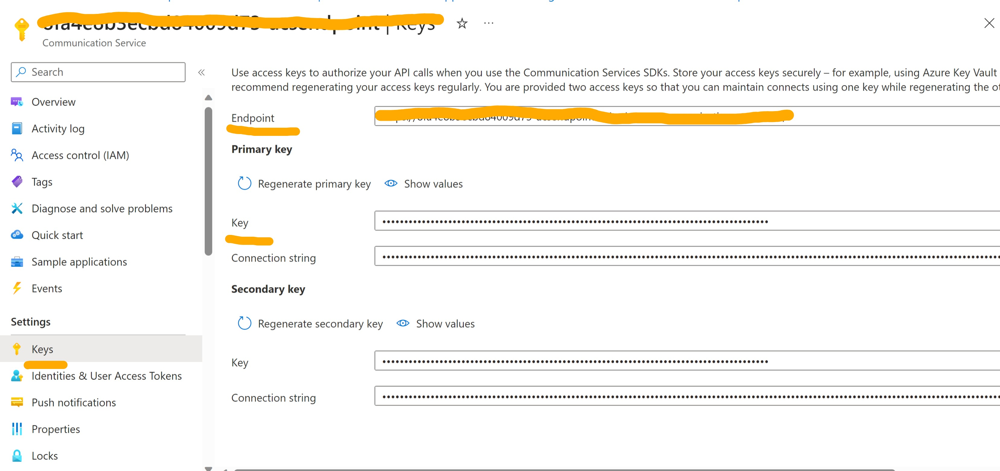
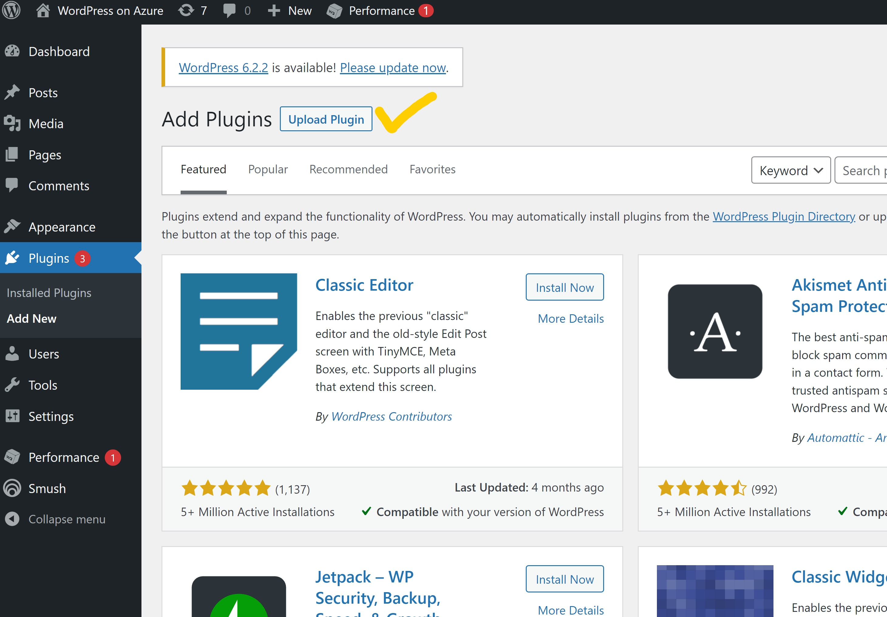

# WordPress Email Integration
The email feature in WordPress is crucial for effective communication and user engagement. WordPress websites often require communication with users for various purposes, such as user registrations, password resets, email notifications, and contact form submissions. WordPress on App Service has been integrated with [Azure Email Communication](https://learn.microsoft.com/en-us/azure/communication-services/concepts/email/email-overview) service to enable email feature

The email Integration with WordPress on Azure AppService can be achieved in 2 ways:
1.	Newly created sites:  Email integration is enabled and configured out of the box
2.	Existing WordPress sites:  It needs an explicit integration setup as per the steps outlined below.  

## 1.Configuring Email with New WordPress Websites
Follow the steps to create a new WordPress website here: [How to set up a new WordPress website on Azure App Service - Microsoft Community Hub](https://techcommunity.microsoft.com/t5/apps-on-azure-blog/how-to-set-up-a-new-wordpress-website-on-azure-app-service/ba-p/3729150)

To enhance the user experience, we have enabled email support for all the SKUs (Basic/Standard/Premium) by default.

As a default option, we offer an Azure managed domain for sending emails from WordPress sites. This seamless integration allows you to easily send emails without the need for additional setup.

## 2.Configuring Email with Existing WordPress Websites

Prerequisites: As a user, you already have an active Azure subscription and an active WordPress site hosted on Azure AppService. 
1.	Create the Azure Communication Resource following the [quick start guide](https://learn.microsoft.com/en-us/azure/communication-services/quickstarts/create-communication-resource?tabs=windows&pivots=platform-azp). 
2.	Create the Email communication Resource following the [quick start guide](https://learn.microsoft.com/en-us/azure/communication-services/quickstarts/email/create-email-communication-resource). 
3.	Add Azure managed domain to email communication service following the [quick start guide](https://learn.microsoft.com/en-us/azure/communication-services/quickstarts/email/add-azure-managed-domains). 
4.	Connect the azure managed domain with azure communication service resource following the [quick start guide](https://learn.microsoft.com/en-us/azure/communication-services/quickstarts/email/connect-email-communication-resource?pivots=azure-portal). 
5.	Go to Azure communication service resource and navigate to keys blade and save the primary key and resource endpoint for later use. 




6.	Go the Azure email managed domain resource and navigate to MailFrom Addresses blade and save the MailFrom address. 
7.	Go the App service resource and add the app setting in the below format 

|Application Settings | Value |
|---------------------|-------|
|WP_EMAIL_CONNECTION_STRING | endpoint=`<endpoint>`;senderaddress=`<sender-address>`;accesskey=`<access-key>`                         |

```         
**Note:** :

1. Replace `<endpoint>` with the Azure communication service endpoint mentioned in step 5. Make sure that
there is no training slash ("/") at the end of the endpoint URL.

2.  Replace `<access-key>` with the Azure communication service primary key mentioned in step 5.

3.  Replace `<sender-address>` with MailFrom Address mentioned in step 6.
```

8.	Download the App service email plugin from here: [Click here](https://github.com/Azure/wordpress-linux-appservice/blob/main/Plugins/app_service_email/1.1.0/app_service_email.zip?raw=true).
9.	Go to Wordpress Admin Dashboard, navigate to plugins tab and then click on add new plugin.



10.	Click on **Upload Plugin** and upload the App service Email plugin zip file (downloaded in above step).
11.	Install and activate the plugin.

After installing and activating the App service email plugin, your email setup is fully configured and ready to be utilized for sending emails from your WordPress website.
