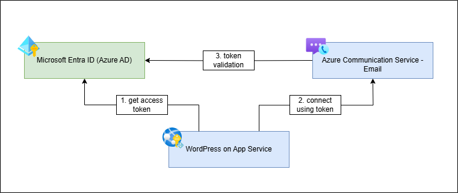
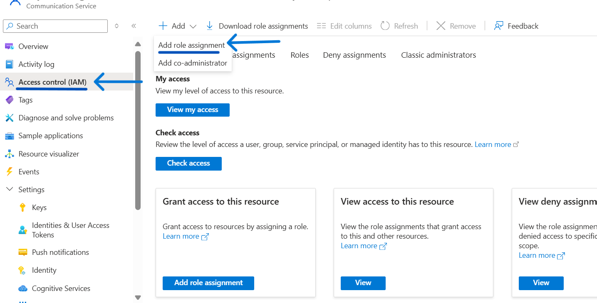
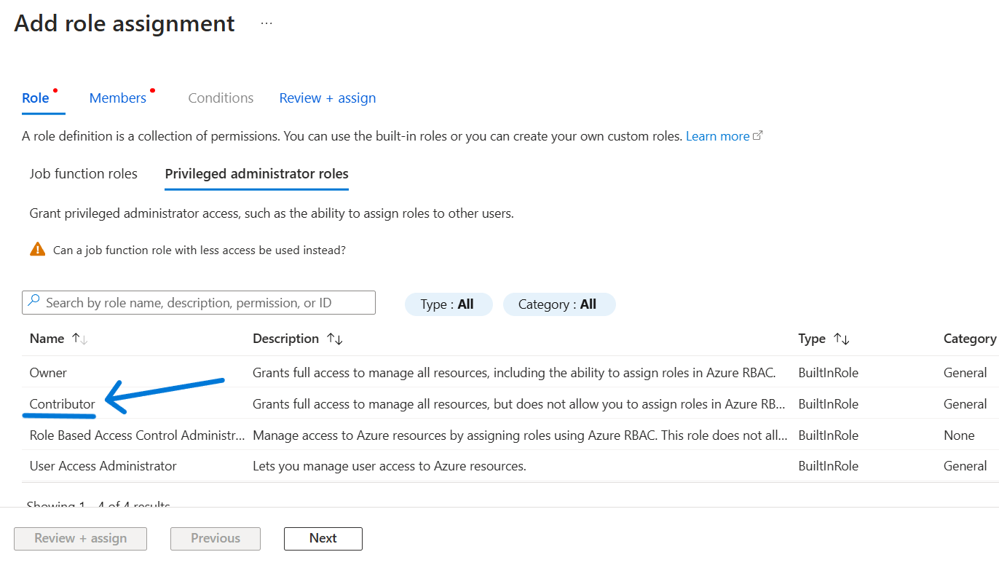
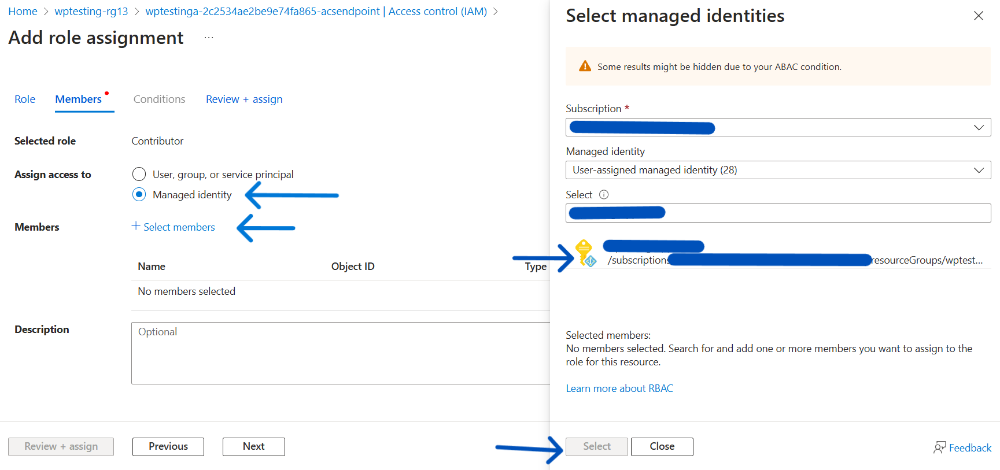
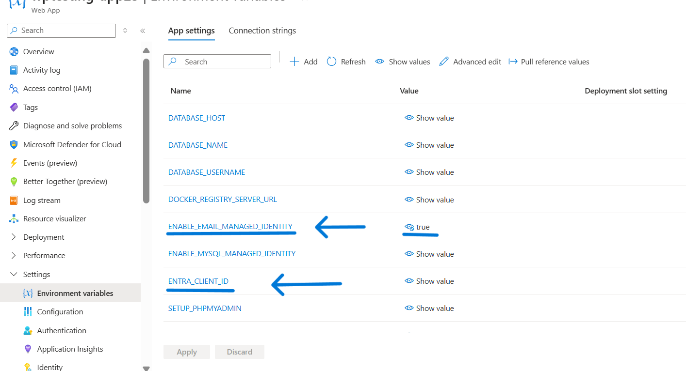

# Enabling Managed Identity with Azure Communication Service Email

A common challenge for developers is the management of secrets, credentials, certificates, and keys used to secure communication between services. Managed identities eliminate the need to manage these credentials and enables access to various services that support Entra ID authentication, without having to insert credentials into your code.

Managed Identity is enabled by default while creating a new WordPress on App Service from the Azure marketplace offering: [Create WordPress on App Service - Microsoft Azure](https://portal.azure.com/#create/WordPress.WordPress). This documentation describes the manual approach to enable Managed Identity with Azure MySQL Flexible Server for existing WordPress App Services.



## Create A User Assigned Managed Identity Resource
- Search for 'Managed Identities' in Azure Portal and create a new user assigned managed identity resource. Refer to the following documentation for more details: [Create a user assigned managed identity](https://learn.microsoft.com/en-us/entra/identity/managed-identities-azure-resources/how-manage-user-assigned-managed-identities?pivots=identity-mi-methods-azp#create-a-user-assigned-managed-identity).
- You can skip this step if you want to re-use an existing user assigned managed identity. Or, if you are using Managed Identity for connecting to Azure MySQL Flexible Server, then you should preferably re-use the same identity for Azure Communication Email Service as well.
    

## Configure Managed Identity With Azure Communication Service Email 

- Go to the Azure Communication Service resource and under the **Access Control (IAM)** section, click on **Add role assignment**.


- Select **'Contributor'** role as shown below and click Next to move to Members tab.


- In Members tab, select **'Managed Identity'** checkbox under **'Assign access to'** section. And then click on **'+Selected memebers'** to add the managed identity. In the new popup blade, select the user assigned managed identity created in the previous steps. Once the identity is added, click on **Review + assign** to update the permissions.



## Configure Managed Identity With WordPress App Service 

### Add user assigned Managed Identity to App Service:

- Go to your App Service and under Settings group, select Identity -> User assigned -> Add. Add the managed identity created in previous steps. For more information refer to the following documentation: [Add user assigned identity](https://learn.microsoft.com/en-us/azure/app-service/overview-managed-identity?tabs=portal%2Chttp#add-a-user-assigned-identity)

    

### Update Environment Variables / Application Settings:
- Add **ENTRA_CLIENT_ID** application setting with client id of the managed identity as the value. You can find client id in the overview section of the user assigned managed identity resource.
- Add **ENABLE_EMAIL_MANAGED_IDENTITY** application setting with value as `true`.

    


### Update App Service Email Plugin (version >= 1.2.0)
- You can download the latest version of App Service Email Plugin from [here](../Plugins/app_service_email/) and upload it using WordPress Admin dashboard. Please note that managed identity support has been enabled from **version 1.2.0**.
- Alternatively, you can also update it using the script available at **/usr/local/bin/managed-identity-setup.sh** inside the container. It can be accessed from SSH console of your App Service. Run the following command from SSH console:
    ```
    sed -i '/^MANAGED_IDENTITY_SETUP_COMPLETED$/d' $WORDPRESS_LOCK_FILE
    bash /usr/local/bin/managed-identity-setup.sh
    ```
- Once the setup is completed, update the **WP_EMAIL_CONNECTION_STRING** application setting (environment variable) in your App Service to remove the `accessKey` parameter from it, as shown below.
    ```
    endpoint=<Endpoint_Value>;senderaddress=<Sender_Address>;accesskey=<AccessKeyValue>
    to
    endpoint=<Endpoint_Value>;senderaddress=<Sender_Address>
    ```
- To test the email connectivity, you can use the 'Forgot Password' option in the WordPress Admin Login page to send a password reset link to your email.