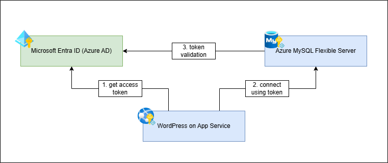
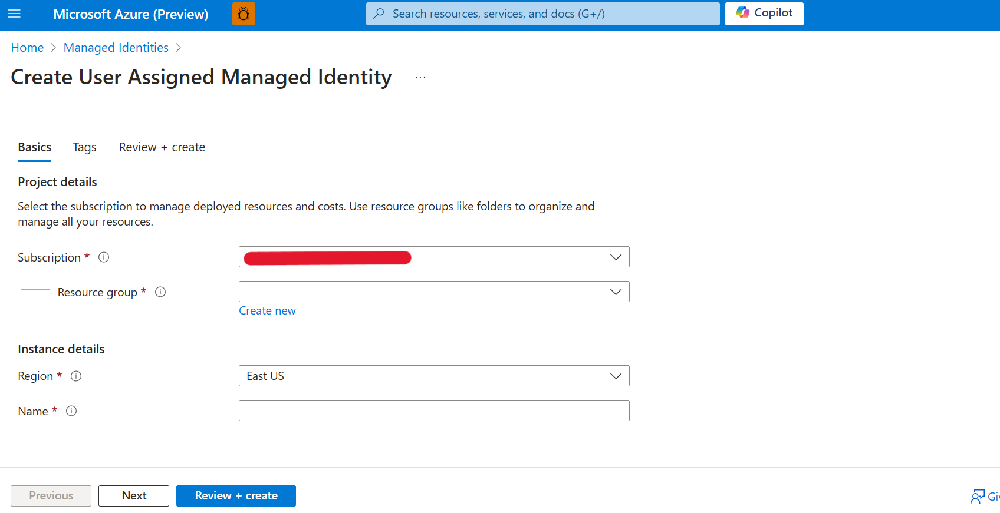
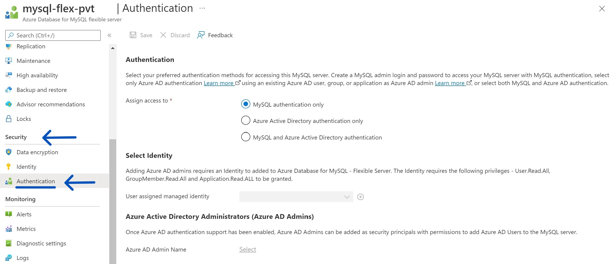
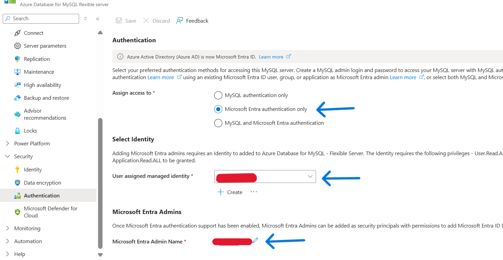
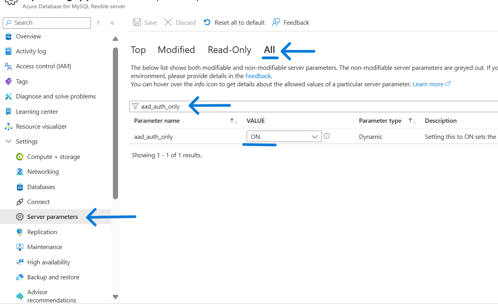
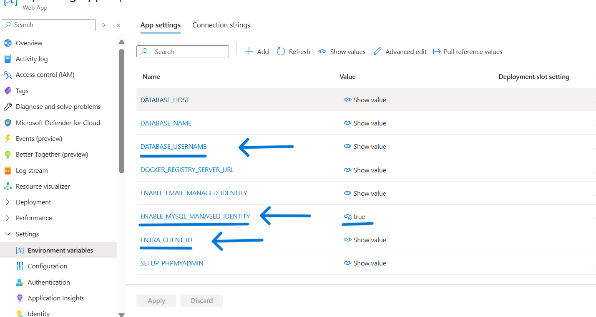

# Enabling Managed Identity with Azure MySQL for WordPress App Service

A common challenge for developers is the management of secrets, credentials, certificates, and keys used to secure communication between services. Managed identities eliminate the need to manage these credentials and enables access to various services that support Entra ID authentication, without having to insert credentials into your code.

Managed Identity is enabled by default while creating a new WordPress on App Service from the Azure marketplace offering: [Create WordPress on App Service - Microsoft Azure](https://portal.azure.com/#create/WordPress.WordPress). This documentation describes the manual approach to enable Managed Identity with Azure MySQL Flexible Server for existing WordPress App Services.



## Create A User Assigned Managed Identity Resource
- Search for 'Managed Identities' in Azure Portal and create a new user assigned managed identity resource. You can skip this step if you want to re-use an existing user assigned managed identity. Refer to the following documentation for more details: [Create a user assigned managed identity](https://learn.microsoft.com/en-us/entra/identity/managed-identities-azure-resources/how-manage-user-assigned-managed-identities?pivots=identity-mi-methods-azp#create-a-user-assigned-managed-identity).
    

## Configure Managed Identity With MySQL Flexible Server 

- Go to the Azure MySQL flexible server resource and under the **Security** blade, select **Authentication**.


- Under Authentication section, select **'Microsoft Entra authentication only'** option. This only allows authentication using Microsoft Entra account and disables MySQL native password authentication.
- Under **Select Identity** – Select the user assigned managed identity created in the previous steps. 
- Under **'Microsoft Entra Admins'**, select the enterprise application corresponding to the managed identity added in previous step. Search with the same name as managed identity, and it should show up. 


- Go to **Server Parameters** blade, and ensure that **'aad_auth_only'** parameter is turned ON. You can search for it under **ALL** section as shown below.

- For more information refer to the following documentation: [Configure the Microsoft Entra Admin](https://learn.microsoft.com/en-us/azure/mysql/flexible-server/how-to-azure-ad#configure-the-microsoft-entra-admin)


## Configure Managed Identity With WordPress App Service 

### Add user assigned Managed Identity to App Service:

- Go to your App Service and under Settings group, select Identity -> User assigned -> Add. Add the managed identity created in previous steps. For more information refer to the following documentation: [Add user assigned identity](https://learn.microsoft.com/en-us/azure/app-service/overview-managed-identity?tabs=portal%2Chttp#add-a-user-assigned-identity)

    

### Update Environment Variables / Application Settings:
- Add **ENTRA_CLIENT_ID** application setting with client id of the managed identity as the value. You can find client id in the overview section of the user assigned managed identity resource.  
- Add **ENABLE_MYSQL_MANAGED_IDENTITY** application setting with value as `true`.
- Update the **DATABASE_USERNAME** application setting with the name of Microsoft Entra Admin added in the MySQL flexible server. This is mostly the same as the name of the managed identity.



### Updating WordPress to use Managed Identity
- The script to updates WordPress code to use Managed Identity is available at **/usr/local/bin/managed-identity-setup.sh** inside the container and can be accessed from SSH console of your App Service. Run the following command from SSH console:
    ```
    sed -i '/^MANAGED_IDENTITY_SETUP_COMPLETED$/d' $WORDPRESS_LOCK_FILE
    bash /usr/local/bin/managed-identity-setup.sh
    ```
- Once the setup is completed, you can remove the **DATABASE_PASSWORD** application setting (environment variable) from your App Service and validate whether your site is up.

### Retrieving access token and accessing MySQL Server
- The script to fetch MySQL access token is available at **/usr/local/bin/fetch-mysql-access-token.sh** inside the container and can be accessed from SSH console of your App Service. Run the following command from SSH console of your App Service:
    ```
    bash /usr/local/bin/fetch-mysql-access-token.sh
    ```
- Database username should be available as **DATABASE_USERNAME** environment variable / application setting in your App Service. Run the following command from SSH console to view it.
    ```
    echo $DATABASE_USERNAME
    ```
- Once you get the username and access token, you can login to the MySQL server from PhpMyAdmin dashboard of your site: `https://<your-app>.azurewebsites.net/phpmyadmin/`. 
- Alternatively, you can use mysql client cli tool to access the database server. Use the below commands from SSH console of your App Service.

    ```
    # install mysql client in Alpine Linux OS
    apk add mysql-client
    apk add mariadb-connector-c

    # fetch the access token and connect to database server
    ACCESS_TOKEN=`bash /usr/local/bin/fetch-mysql-access-token.sh`
    mysql -h $DATABASE_HOST --user $DATABASE_USERNAME --enable-cleartext-plugin --password=$ACCESS_TOKEN --ssl-ca=$MYSQL_CA_CERT_FILE
    ```    
