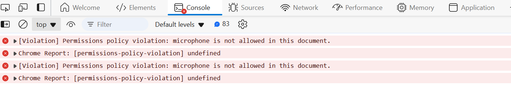

# How to enable Microphone and Camera with WordPress App Service


This document provides the instruction on how to resolve the **'permissions-policy-violation'** errors that you encounter in browser when using Microphone or Camera with your WordPress website. By default these headers are disabled in the Nginx Configuration and you can enable them using the steps below. 



## Steps

1. Go the SSH console of your App Service and run the below code only once. This copies the required nginx configuration file to the persistent storage under /home directory.
    ``` bash
    cp /etc/nginx/conf.d/spec-settings.conf /home/custom-spec-settings.conf
    ```

2. Edit /home/custom-spec-settings.conf using vi/vim editors. Search and update the **Permissions-Policy** header value as shown below. By default the allowlist for microphone and camera are set to none, and we are updating it to allow for `self` origin.

    **Old Value**
    ``` nginx
    add_header Permissions-Policy "geolocation=(),midi=(),sync-xhr=(),microphone=(),camera=(),magnetometer=(),gyroscope=(),fullscreen=(self)";
    ```
    **New value**
    ``` nginx
    add_header Permissions-Policy "geolocation=(),midi=(),sync-xhr=(),microphone=(self),camera=(self),magnetometer=(),gyroscope=(),fullscreen=(self)";
    ```
    - Please note that you can use `self`, `*`, empty value (none), or any specific origin in the allowlist. For instance, `microphone(self)` or `microphone(*)` or `microphone()`. For more information refer to [Permissions-Policy Headers](https://developer.mozilla.org/en-US/docs/Web/HTTP/Headers/Permissions-Policy)
    
    - You can also edit the custom-spec-settings.conf file from the file manager (`https://<appname>.scm.azurewebsites.net/newui/fileManager`). Click on the 'pencil' icon to edit the file.


3. Now copy the following code snippet to **/home/dev/startup.sh** file.
    ```bash
    cp /home/custom-spec-settings.conf /etc/nginx/conf.d/spec-settings.conf
    /usr/sbin/nginx -s reload
    ``` 

4. Now try to execute the startup.sh script from SSH console and see if there are any errors. You can validate if microphone and camera are working in the browser.
    ```
    cd /home/dev
    ./startup.sh
    ```

5. If you see any errors related to supervisord process, then replace the code in /home/dev/startup.sh file with below one. Otherwise, ignore this step.
    ```bash
    cp /home/custom-spec-settings.conf /etc/nginx/conf.d/spec-settings.conf
    kill $(ps aux | grep 'nginx' | awk '{print $1}') 2> /dev/null
    ```

6. Now Restart your App Service and validate if microphone or camera are working properly.


## References:
- [Setup Startup scripts for WordPress running on Linux AppService](./running_post_startup_scripts.md).
- [Configure nginx for Various WordPress Scenarios](./configuring_nginx_for_wordpress.md)
