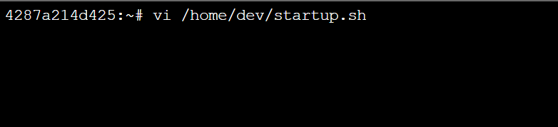

# Startup Script in WordPress

In this article, you learn about configuring a custom startup script, if needed, for a WordPress site hosted on Linux App Service. For running locally, you don't need a startup file. However, when you deploy a web app to Azure App Service, your code is run in Docker container that can use any startup commands if they are present.

The major problem that is solved using startup script is updating files in non-persistent storage (see App Service Storage section). Linux App Service architecture inherently has non-persistent storage i.e. file changes do not sustain after app restart. Custom configuration of any tool such as nginx wouldn't be possible by simply updating nginx config files since they would revert back when the app service restarts. Startup script enables you to add startup commands that are executed after an app container starts to make file changes that sustain through app restarts. 
 
 
## How Startup script works?
 
It is a bash script (in /home/dev/startup.sh) that is executed each time an app container starts and the changes made by startup commands remain constant throughout.

## App Service Storage
 
WordPress App Services (Linux) use a central App Service Storage which is a remote storage volume mounted onto the '/home' directory in the app container. App Service Storage is persistent storage and used to host the WordPress code (in /home/site/wwwroot). It is shared across containers when the app service is scaled out to multiple instances.

## Configure Startup script
 
The startup script is an empty file by default. Navigate to Webssh in scm portal of your WordPress app to update the startup script using the defaults vim/vi editors as shown below.  
 
<kbd></kbd>

<kbd></kbd>

<kbd></kbd>
 
Add your start-up commands to /home/dev/startup.sh file using the default vi/vim editors as shown below.  

<kbd></kbd>

 
Restart your app and the updated startup script would be executed post container restart
 
NOTE: Make sure the start-up script is tested (preferably in a test deployment slot of your app service) prior to moving into production.
 