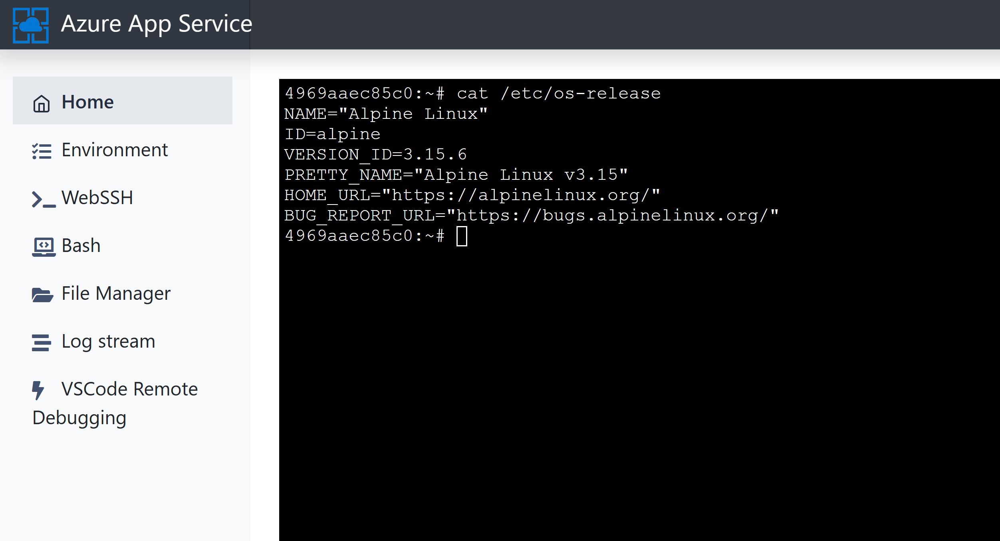
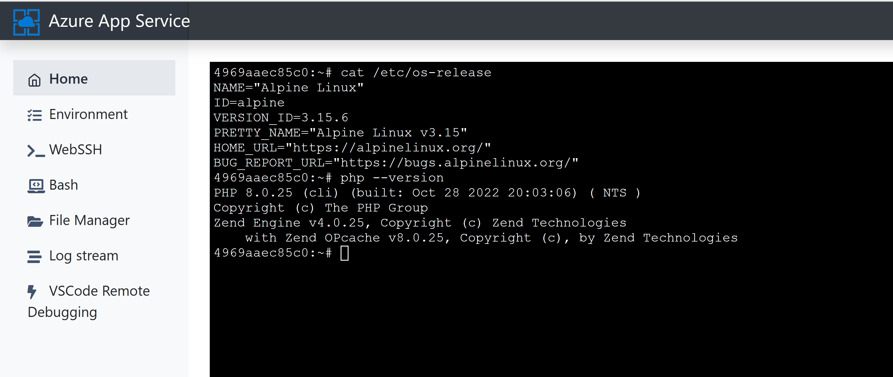

# Migrate the WordPress images running on a different container to Microsoft supported containers

This document describes the approach to migrate WordPress instances running on Linux App Service (using different container) to the latest new WordPress image **(mcr.microsoft.com/appsvc/wordpress-alpine-php)**.

**Note-1:** The steps described below under section **Steps for migrating the docker container** will upgrade the underlying stack such as Nginx, PHP, Redis etc., and it will not upgrade/refresh the WordPress version or source code.  As a result, sometimes there can be compatibility issue between the upgraded PHP version and underlying WordPress code. So upgrading the WordPress to latest comptabile version with the PHP version as per the [PHP Compatibility and WordPress Versions](https://make.wordpress.org/core/handbook/references/php-compatibility-and-wordpress-versions/) is the responsibility of the user.

It is recommended to migrate the image first in staging environment, test it thoroughly and then plan for your migration in production environments. 

**Note-2:** Another approach for migration would be to create a new instance of WordPress on Linux App Service from Azure Marketplace and then migrate the content from your existing WordPress site by following the [WordPress Migration Guide](./wordpress_migration_linux_appservices.md). 

## Steps for migrating the docker container
1. Make sure your WordPress code is in **/home/site/wwwroot** path.
2. Create the following folder **/home/wp-locks** using SCM site (**https://_\<appname\>_.scm.azurewebsites.net/newui**).
3. Download [wp_deployment_status.txt](./files/wp_deployment_status.txt) file and upload it to /home/wp-locks folder. This will prevent re-installation of WordPress and deletion of any old data when you migrate to the new image.
4. Take a back-up of your wp-config.php
5. Replace the wp-config.php file located at **/home/site/wwwroot** with the new file located [here](https://github.com/Azure-App-Service/ImageBuilder/blob/master/GenerateDockerFiles/wordpress/wordpress/wordpress_src/wordpress-azure/wp-config.php). 
6. Add the additional configurations from your backup wp-config.php file if any, and add any other additional custom configurations you may want to include and save the file.
7. Now launch the Azure Portal and navigate to your App Service definition page. 
8. Navigate to Configuration blade and verify the Application Settings. Make sure the following Application Settings are present and configured correctly.

    |    Application Setting Name            |  Value   |
    |----------------------------------------|----------|
    |    WEBSITES_ENABLE_APP_SERVICE_STORAGE |  true    |
    |    DATABASE_HOST                       | *\<actual value\>* |
    |    DATABASE_NAME                       | *\<actual value\>* |
    |    DATABASE_PASSWORD                   | *\<actual value\>* |
    |    DATABASE_USERNAME                   | *\<actual value\>* |

9. Navigate to Deployment Center blade and update the new image details  with appropriate **tag** value as shown in the below screen shot.

10. Restart your App Service to take the changes into effect. 
11. To cross verify, launch (**https://_\<appname\>_.scm.azurewebsites.net/newui/webssh**)
12. In webssh console, run **cat /etc/os-release** command. It should show the Alpine version as shown in below screenshot

13. Run php --version command to validate the image is on latest php version as shown below

14. Now launch WP-Admin and upgrade WordPress version to latest recommended version as hinted in the Admin UI
15. Alternatively, you can follow the steps described in Manual Updates section of this [document](https://wordpress.org/support/article/updating-wordpress/). 
