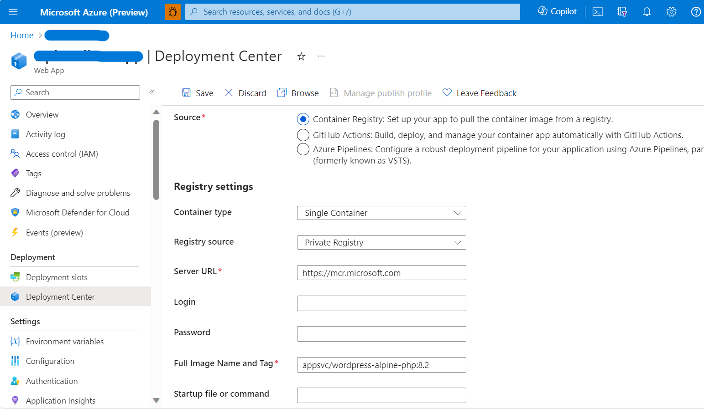

# Upgrading from Other WordPress Images

This document describes the approach to upgrade WordPress instances (using other images) running on Linux App Service to the new [WordPress image](https://mcr.microsoft.com/appsvc/wordpress-alpine-php).

**Note-1:** Please note that the following process to upgrade the image will only refresh the underlying tools such as Nginx, PHP, Redis etc., And it doesn't upgrade/refresh the existing WordPress version or source code. As a result, sometimes there can be compatibility issue between PHP version and existing WordPress code. It is recommended to test the changes thoroughly in a staging environment before making any changes to the production. And it is responsbility of the users to upgarde their WordPress source code to make it compatible with the PHP version.

**Note-2:** Another approach for migration would be to create a new instance of WordPress on Linux App Service from Azure Marketplace and then migrate the old WordPress by following the steps mentioned [here](./wordpress_migration_linux_appservices.md). 

## Steps for Upgrading
1. Create the following folder **/home/wp-locks** using SCM site **\<appname\>.scm.azurewebsites.net**.
2. Upload [wp_deployment_status.txt](./files/wp_deployment_status.txt) file to /home/wp-locks folder.
3. Make sure the following Application Settings are present and configured correctly.

    |    Application Setting Name            |  Value   |
    |----------------------------------------|----------|
    |    WEBSITES_ENABLE_APP_SERVICE_STORAGE |  true    |
	|    DATABASE_HOST                       | *\<actual value\>* |
	|    DATABASE_NAME                       | *\<actual value\>* |
	|    DATABASE_PASSWORD                   | *\<actual value\>* |
	|    DATABASE_USERNAME                   | *\<actual value\>* |

4. Update the new image details in the deployment centre with appropriate **tag** value and restart your App Service. 
<kbd></kbd>
